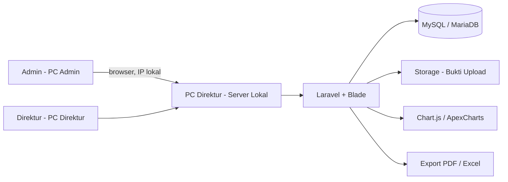

# Architecture — Sistem Informasi SPK & Kontrol Keuangan
## PT Barelang Kontraktor Sarana

> **Stack:** Laravel 13 · Filament 5 (panel `/admin`) · MySQL/MariaDB · PHP 8.5
> **Perubahan utama dari draf awal:** deployment lokal 2 PC · **Filament** (bukan Blade) ·
> tanpa approval · SPK entitas inti · **5 tabel + PHP Enum**.

---

## 1. Prinsip Arsitektur

1. **Monolitik** — sederhana, mudah dirawat tim kecil (1–3 developer).
2. **Tidak menggunakan microservices**, message queue, atau container orchestration.
3. **Server-rendered** dengan Blade Template — tanpa build pipeline berlebihan.
4. **On-premise / lokal** — berjalan di jaringan kantor, bukan cloud.
5. **Satu sumber data** — database hanya di satu PC (server), mencegah data terpecah.
6. **SPK sebagai entitas inti** — tidak ada entitas PROYEK (keputusan #1).
7. **Tanpa alur approval** — Admin langsung mencatat transaksi (keputusan #2 & #4).
8. **Fleksibel pada bagian keuangan** — struktur disiapkan longgar karena contoh data final
   dari Admin/keuangan belum diterima.

> ⚠️ **Keputusan deployment belum dikunci:** pilihan **lokal / cloud / hybrid** masih menunggu
> keputusan atasan. Dokumen ini mengasumsikan **lokal** karena itulah yang dijelaskan di BAB VI
> SRS, tetapi dokumen sumber masih tidak konsisten. Lihat §11.

## 2. Tech Stack

| Layer | Teknologi | Alasan |
|---|---|---|
| Backend Framework | **Laravel 13** (full Laravel) | Matang, dokumentasi lengkap, cocok CRUD & laporan |
| Bahasa | PHP 8.3+ | Kebutuhan minimum Laravel modern |
| Database | **MySQL / MariaDB** | Relasional, stabil, gratis |
| ORM | Eloquent ORM | Relasi eksplisit, query aggregate |
| Validasi Enum | **PHP Enum + `Rule::enum()`** | ⭐ Pengganti tabel master (lihat `Schema.md` §7) |
| **Frontend / Admin Panel** | **Filament 5** (`/admin`) | ⚠️ **MENYIMPANG dari SRS** — lihat catatan di bawah |
| Tema Tampilan | **Clean Minimalist Enterprise** (Vercel/Linear) — CSS tema Filament | Monokrom, border tipis, font sistem |
| Authentication | Filament Login + Laravel Auth | Login, logout, session, password hashing |
| Authorization | `canAccessPanel()` + `canCreate/canEdit/canDelete` + trait `BolehUbahData` | Batasi akses Admin/Direktur |
| File Storage | Laravel Storage | Simpan bukti transaksi (uang masuk & keluar) |
| Grafik | Chart.js (bawaan Filament ChartWidget) | Grafik arus kas, status SPK, kategori |
| Export Laporan | **CSV** (bawaan, tanpa paket) | Bisa dibuka di Excel — aplikasi yang dipakai perusahaan |
| **Deployment** | **Lokal di PC Direktur (jaringan kantor)** | Biaya rendah, data tetap di perusahaan |
| Web Server Lokal | Apache/Nginx (via Laragon/XAMPP) | Menjalankan aplikasi di port lokal |
| Backup | `php artisan bks:backup` + Laravel Scheduler | Dump harian `.sql.gz`, retensi 30 hari |

> ⚠️ **PERUBAHAN PENTING dari v1.0 — Frontend BUKAN Blade lagi:**
>
> SRS mengunci frontend ke **Blade Template**, tetapi implementasi memakai
> **Filament 5** (panel admin di `/admin`). Alasannya:
> - 5 modul CRUD (SPK, Mitra, Uang Masuk, Uang Keluar, Pengguna) + laporan
>   dikerjakan jauh lebih cepat, dengan tabel/filter/pencarian/upload bawaan.
> - Menghemat waktu pengerjaan magang secara signifikan.
> - Model, migration, Enum, dan seluruh logika bisnis **tetap sama** —
>   Filament bekerja di atas Eloquent yang sudah ada.
>
> **Konsekuensi:** dokumen SRS menyebut Blade → **tidak sinkron** dengan implementasi.
>
> **Catatan:** halaman Blade lama (dashboard & login) sudah **dihapus** dan
> digantikan Filament sepenuhnya.

> ✅ **Perubahan dari draf awal:** *Hosting VPS* **dihapus** → **deployment lokal**.

## 3. Struktur Modul Aplikasi

```
app/
├── Enums/                 # PHP Enum: Peran, StatusSpk, StatusTagihan,
│                          #   KategoriPengeluaran, KategoriMitra, AkunKas, StatusAntar, DikerjakanOleh
├── Models/                # 5 model Eloquent (Pengguna, Mitra, Spk, UangMasuk, UangKeluar)
├── Filament/              # Panel admin /admin
│   ├── Resources/         #   Spks · Mitras · Penggunas · UangMasuks · UangKeluars · MonitoringSpk
│   ├── Pages/             #   Dashboard, Laporan
│   ├── Widgets/           #   kartu ringkasan & grafik
│   ├── Exports/           #   ekspor per menu
│   ├── Actions/           #   CatatPembayaran
│   └── Concerns/          #   BolehUbahData, FilterPeriodeUang, PratinjauNotaPrivat
├── Services/              # PembacaNota (OCR), PenyimpanBerkas
├── Observers/             # SinkronStatusTagihanObserver
├── Http/Middleware/       # PastikanPeran, HeaderKeamanan
└── Support/               # Format (rupiah), Nota
```

> 📌 **Karena schema hanya 5 tabel**, status & kategori **tidak** punya tabel master.
> Nilainya dikelola lewat **PHP Enum** di `app/Enums/` dan divalidasi dengan
> `Rule::enum()`. Ini wajib — lihat `Schema.md` §7 untuk bukti risikonya.

> ❌ **Modul yang TIDAK ada** (keputusan user):
> `Proyek/` — tidak ada entitas PROYEK · `PengajuanDana/` — tidak ada pengajuan dana ·
> `Approval/` — tidak ada approval Direktur · `Bukti/` — bukti jadi kolom di tabel transaksi ·
> `MasterData/` — status & kategori pakai Enum, bukan tabel master

## 4. Alur Data Tingkat Tinggi

```
[Admin Input]
     │
     ├──► Master Data ──► partner, status, kategori
     │
     ├──► SPK ──► validasi ──► simpan
     │             └──► (retensi TIDAK dihitung — lihat Rules.md §2)
     │
     ├──► Uang Masuk
     │      ├── Mode 1: pilih SPK  ──► spk_id terisi
     │      └── Mode 2: manual     ──► spk_id NULL
     │      └──► upload bukti
     │
     └──► Uang Keluar
            ├── kategori pengeluaran
            ├── relasi SPK (opsional) ──► spk_id terisi / NULL
            └──► upload bukti (jumlah file bebas)
                    │
                    ▼
        [Dashboard & Laporan membaca agregat]
                    │
                    ▼
   Saldo · Piutang per SPK · Laba-rugi per SPK
```

> ⚠️ **Tidak ada langkah approval.** Transaksi langsung tercatat saat Admin menyimpan.
> Karena itu, **tidak ada** `DB::transaction` untuk alur approval.

## 5. Keamanan & Integritas Data

1. **Password** di-hash Laravel (Bcrypt/Argon2) — tidak pernah plain text, tidak pernah di-log.
2. **Authorization** memakai middleware role — **bukan** hanya menyembunyikan menu.
3. **Nominal rupiah** disimpan `DECIMAL(18,2)` — **bukan** `FLOAT`, mencegah galat presisi.
4. **Foreign key constraint** pada semua relasi.
5. **Audit log** mencatat: user, aksi, tabel, ID record, nilai lama, nilai baru, waktu.
6. **Upload bukti** divalidasi MIME type, ukuran maksimal (5–10 MB), nama file unik
   (timestamp/UUID), hanya dapat diakses user yang sudah login.
7. **Tidak ada penghapusan permanen** — gunakan soft delete dengan jejak audit.
8. **Rahasia & kredensial** hanya melalui `.env` — tidak boleh ter-commit ke Git.
9. **Batasi akses folder upload dan database** agar tidak diubah di luar aplikasi.

## 6. Kebutuhan Non-Fungsional

| Aspek | Target |
|---|---|
| Pengguna bersamaan | Skala internal kecil (perkiraan < 10 pengguna aktif) |
| Waktu respons laporan | < 3 detik untuk data 1 tahun berjalan |
| Backup | Harian/mingguan — data keuangan kritikal |
| Ketersediaan | Selama PC server menyala (jam kerja) |

> ⚠️ **Koreksi dari v1.0:** dokumen lama menulis *"~20-30 pengguna bersamaan"*.
> Untuk skenario 2 PC, angka itu tidak realistis dan sudah dikoreksi.

---

## 7. DEPLOYMENT LOKAL — Topologi 2 PC

Bagian ini **tidak ada di v1.0**. Sesuai BAB VI SRS.

### 7.1 Topologi

```
        ┌──────────────────────────────────────────────┐
        │         ROUTER / SWITCH LAN KANTOR            │
        └───────┬──────────────────────────┬────────────┘
                │                          │
                ▼                          ▼
    ┌────────────────────────┐   ┌────────────────────────┐
    │  PC DIREKTUR           │   │  PC ADMIN              │
    │  = SERVER LOKAL        │   │  = CLIENT              │
    │  + client Direktur     │   │                        │
    │                        │   │                        │
    │  • Laravel             │   │  • Browser saja        │
    │  • MySQL/MariaDB       │   │  • Akses:              │
    │  • Apache/Nginx        │   │    http://192.168.1.10 │
    │  • Dashboard Direktur  │   │                        │
    │                        │   │                        │
    │  IP statis:            │   │                        │
    │  192.168.1.10          │   │                        │
    └────────────────────────┘   └────────────────────────┘
```

### 7.2 Peran Perangkat

| Perangkat | Fungsi | Keterangan |
|---|---|---|
| **PC Direktur** | Server lokal **dan** client Direktur | Menjalankan Laravel, MySQL/MariaDB, web server; **tetap dipakai untuk pekerjaan harian Direktur** |
| **PC Admin** | Client pengguna Admin | Akses via browser memakai IP lokal PC Direktur |
| **Jaringan LAN/Wi-Fi Kantor** | Media komunikasi | Kedua PC harus di jaringan lokal yang sama |

> ✅ **Keputusan user:** PC Direktur **boleh dipakai untuk kerja lain** (tidak dedicated server).
> Karena itu, langkah mitigasi berikut **wajib** agar aplikasi tidak mengganggu pekerjaan Direktur:
>
> | Mitigasi | Alasan |
> |---|---|
> | **Auto-start service** (§7.6) | Aplikasi hidup sendiri tanpa perlu buka terminal/CMD |
> | **Batasi resource MySQL** | Set `innodb_buffer_pool_size` wajar (mis. 512MB–1GB) agar tidak menghabiskan RAM |
> | **Jadwalkan backup di luar jam kerja** | `mysqldump` berat — jalankan malam/siang istirahat |
> | **Monitoring kapasitas** | Cek RAM/disk berkala; kalau sudah berat, pertimbangkan mini server/NAS |
> | **UPS** (§7.9) | Melindungi PC kerja Direktur **dan** data keuangan sekaligus |
>
> ⚠️ **Risiko yang diterima:** karena PC ini dipakai kerja lain, aplikasi bisa melambat saat
> Direktur membuka banyak program. Ini sudah disadari dan diterima sebagai konsekuensi
> keputusan "tidak beli PC khusus server".

### 7.3 Alur Akses Sistem

1. Aplikasi Laravel dipasang pada **PC Direktur**.
2. Database MySQL/MariaDB berjalan pada PC Direktur.
3. Web server lokal (Apache/Nginx/Laragon/XAMPP) menjalankan aplikasi pada port tertentu.
4. PC Direktur membuka sistem via `http://localhost` atau alamat lokal.
5. PC Admin membuka via browser memakai IP PC Direktur, mis. `http://192.168.1.10`.
6. Admin melakukan input SPK, uang masuk, uang keluar, dan upload bukti.
7. Direktur membuka dashboard pada PC Direktur untuk memantau.
8. Seluruh data tersimpan di database lokal pada PC Direktur.

### 7.4 Rekomendasi Konfigurasi Teknis

| Komponen | Rekomendasi | Catatan |
|---|---|---|
| Web Server Lokal | Apache/Nginx via **Laragon** atau XAMPP | Laragon disarankan untuk kemudahan di Windows |
| Database | MySQL atau MariaDB | Di PC Direktur sebagai sumber data utama |
| IP PC Direktur | **Static IP lokal** | Agar PC Admin tidak perlu ganti alamat akses |
| Firewall | Allow port web server (80/8080/8000) | Agar PC Admin dapat mengakses |
| Storage Upload | Folder `storage` Laravel | Menyimpan bukti transaksi |
| Backup | Database harian/mingguan | Ke flashdisk, HDD eksternal, atau cloud manual |

> ⚠️ **Jangan gunakan `php artisan serve` untuk pemakaian harian** — hanya untuk development.
> Gunakan web server proper (Apache/Nginx).

### 7.5 Spesifikasi PC Direktur

| Komponen | Minimum | Disarankan |
|---|---|---|
| CPU | Dual-core | Quad-core |
| RAM | 4 GB | 8 GB |
| Storage | 128 GB SSD | 256 GB SSD |
| Jaringan | Ethernet (kabel) | Ethernet + IP statis |
| Listrik | — | **UPS** (sangat disarankan) |

### 7.6 Auto-start Service

- **Windows:** Laragon sudah auto-start; atau gunakan NSSM untuk web server & MariaDB
  sebagai Windows Service.
- **Linux:** daftarkan Nginx, PHP-FPM, dan MariaDB sebagai `systemd` service (`systemctl enable`).

### 7.7 Backup (WAJIB)

Data keuangan kritikal — backup tidak boleh mengandalkan disiplin manual.

**✅ SUDAH DIIMPLEMENTASI:** `php artisan bks:backup`

| Aspek | Implementasi |
|---|---|
| Perintah | `php artisan bks:backup` |
| Hasil | `storage/app/backup/bks-YYYY-MM-DD-HHMMSS.sql.gz` |
| Kompresi | `gzencode` PHP (tidak butuh binary `gzip`) |
| Retensi | Otomatis hapus backup > 30 hari (`--hari=N` untuk mengubah) |
| Jadwal | **Harian 23:00** via Laravel Scheduler (`routes/console.php`) |
| Isi | `mysqldump --single-transaction --routines --triggers` (13 tabel) |
| Sudah diuji | ✅ Dump 11 KB, **restore berhasil** (4 SPK, 2 pengguna terbaca) |

**⚠️ WAJIB dijalankan agar jadwal bekerja** (pilih salah satu):

```bash
# Linux/macOS — crontab -e
* * * * * cd /path/ke/proyek && php artisan schedule:run >> /dev/null 2>&1

# Windows — Task Scheduler
# Buat tugas harian yang menjalankan:
#   php artisan schedule:run
```

Cek jadwal terdaftar:
```bash
php artisan schedule:list
```

**⚠️ Yang MASIH perlu dilakukan manual** (belum bisa diotomatiskan):

| Strategi | Frekuensi | Simpan di |
|---|---|---|
| Salin hasil dump ke media eksternal | Harian/mingguan | Flashdisk / HDD eksternal |
| Salin ke lokasi kedua | Mingguan | Cloud (terenkripsi) |

> Backup yang tersimpan di **komputer yang sama** tidak melindungi dari
> kerusakan hardisk. **Salin keluar dari PC Direktur.**

Saran konkret:
- Rotasi **7 backup harian + 4 mingguan + 12 bulanan** (otomatis: 30 hari).
- **Uji restore** minimal sekali sebelum sistem dipakai penuh.
- Backup juga `storage/app` (folder bukti) — bagian dari audit trail.

### 7.8 Catatan Risiko Deployment Lokal

| Risiko | Mitigasi |
|---|---|
| PC Direktur mati → PC Admin tidak dapat mengakses | UPS, auto-start service, pertimbangkan mini server/NAS jika pemakaian meningkat |
| IP PC Direktur berubah → alamat akses harus diperbarui | **Static IP** atau reservasi DHCP di router |
| Tanpa backup rutin → data berisiko hilang | Backup otomatis + uji restore berkala |
| PC Direktur tetap dipakai kerja harian → performa dapat mengganggu aktivitas Direktur | Monitoring kapasitas, batasi aplikasi berat |
| Folder upload & database bisa diubah di luar aplikasi | Batasi permission folder, akun OS khusus service |

### 7.9 Antisipasi Mati Listrik

- **UPS** untuk PC Direktur dan router — minimal tahan 15 menit agar shutdown rapi.
- Aktifkan auto-shutdown saat daya UPS lemah.
- Hindari menyalakan PC server tanpa UPS.

### 7.10 Akses dari Luar Kantor (Fase 2 — Opsional)

| Cara | Kelebihan | Kekurangan |
|---|---|---|
| **Tailscale** (VPN mesh) | Aman, tidak perlu buka port, gratis skala kecil | Perlu install di tiap perangkat |
| **Cloudflare Tunnel** | Tidak perlu IP publik | Tergantung pihak ketiga |
| Port forwarding router | Tanpa software tambahan | ⚠️ **Berisiko** — tidak disarankan |

**Rekomendasi:** Tailscale. **Jangan** buka aplikasi langsung ke internet.

---

## 8. Diagram Konseptual



## 9. Persyaratan Serah Terima

| No | Luaran | Format |
|---|---|---|
| 1 | Source Code GitHub | Repository (Laravel, Blade, controller, model, migration, middleware) |
| 2 | Database Migration | Laravel Migration |
| 3 | Database Production | MySQL / MariaDB |
| 4 | Hak Akses Akun Server | Credential tertutup |
| 5 | Akun Admin Sistem | Credential tertutup |
| 6 | Akun Direktur Sistem | Credential tertutup |
| 7 | Buku Panduan Admin | PDF / DOCX |
| 8 | Buku Panduan Direktur | PDF / DOCX |
| 9 | Dokumen SRS | PDF / Markdown |
| 10 | Dokumen ERD | PNG / PDF / Markdown |
| 11 | Dokumen Flowchart | PNG / PDF / Link |
| 12 | Dokumen Test Case | Excel / PDF / Markdown |
| 13 | Bug Report | Excel / PDF |
| 14 | Berita Acara Serah Terima | PDF / DOCX |

## 10. Checklist Final Deployment

- [ ] Repository GitHub sudah final
- [ ] File `.env` lokal dikonfigurasi untuk jaringan kantor
- [ ] Database lokal sudah dibuat di PC Direktur
- [x] Migration berhasil dijalankan
- [ ] Storage link & permission folder upload benar
- [x] Akun Admin dan Direktur sudah dibuat
- [x] Role middleware sudah diuji
- [x] Form SPK berjalan
- [x] ~~Retensi 5%~~ — TIDAK dipakai (dihapus 19 Sep 2026, dokumen diselaraskan 26 Sep 2026)
- [x] Form uang masuk (2 mode) berjalan
- [x] Form uang keluar berjalan
- [x] Upload bukti berjalan
- [x] Perhitungan saldo & piutang akurat — **laba-rugi TIDAK dihitung** (Rules §2)
- [x] Dashboard menampilkan data yang benar
- [ ] Black-box testing selesai
- [ ] Bug prioritas tinggi sudah diperbaiki
- [ ] Manual book Admin dan Direktur tersedia
- [ ] Sistem terpasang di PC Direktur sebagai server lokal
- [ ] PC Admin berhasil mengakses via jaringan lokal
- [ ] Backup database lokal sudah disiapkan
- [ ] Berita acara serah terima disiapkan

## 11. ⚠️ Inkonsistensi yang Belum Terselesaikan

| No | Inkonsistensi | Status |
|---|---|---|
| 1 | **Deployment:** sebagian dokumen menyebut *cloud production*, BAB VI menetapkan *PC Direktur sebagai server lokal* | ⏳ Menunggu keputusan atasan |
| 2 | **ERD bergambar pada SRS** masih memuat `projects`, `subcon_spks`, `cash_requests`, `attachments` | ⚠️ Gambar perlu diperbarui agar sesuai schema final (**5 tabel**) |
| 3 | **Kolom `keterangan` pada SPK** | ✅ **Dihapus** (keputusan user) |
| 4 | **Dokumen SPK** | ✅ **Selesai** — kolom `spk.dokumen` (JSON) |

> ✅ **Sudah diselesaikan** (keputusan user 19 Sep 2026): entitas PROYEK dihapus · pengajuan dana
> & approval dihapus · SPK subkon dilebur ke tabel `spk` · approval uang keluar dihapus ·
> tabel bukti dihapus (bukti jadi kolom).

---

## 12. Langkah Pemasangan di PC Server

Ringkasan dari topologi §7. Hanya **PC server** yang menjalankan aplikasi &
database; PC lain cukup buka browser.

### 12.1 Set IP tetap (STATIC) — WAJIB

Kalau IP berubah, semua PC lain kehilangan akses.

```bash
ip -4 addr show | grep inet      # catat IP 192.168.x.x
```

- **Cara A (di PC):** Pengaturan Jaringan → IPv4 → Manual. Isi Address,
  Netmask `255.255.255.0`, Gateway (IP router), DNS.
- **Cara B (di router):** DHCP Reservation — kunci MAC PC server ke IP tertentu.

### 12.2 Atur `.env` untuk server

```env
APP_ENV=production
APP_DEBUG=false                      # WAJIB false
APP_URL=http://192.168.100.134       # ganti dengan IP server
DB_CONNECTION=mysql
DB_DATABASE=bks
SESSION_DRIVER=database
```

> ⚠️ `APP_DEBUG=false` wajib — kalau `true`, error menampilkan isi database &
> struktur tabel ke siapa pun.

```bash
php artisan config:clear && php artisan config:cache
php artisan route:cache && php artisan view:cache
php artisan storage:link
```

### 12.3 Cara menjalankan

| Opsi | Perintah | Untuk |
|:-----|:---------|:------|
| **A. `artisan serve`** | `php artisan serve --host=0.0.0.0 --port=8000` | Uji coba cepat — **hanya 1 pengguna sekaligus** |
| **B. Nginx + PHP-FPM** ⭐ | lihat contoh config di bawah | Pemakaian sehari-hari |

> ⚠️ Jangan pakai `artisan serve` untuk pemakaian bersama/harian.

```nginx
server {
    listen 80;
    server_name 192.168.100.134;
    root /path/ke/proyek/public;
    index index.php;
    client_max_body_size 50M;                 # batas upload nota
    location / { try_files $uri $uri/ /index.php?$query_string; }
    location ~ \.php$ {
        fastcgi_pass unix:/run/php-fpm/php-fpm.sock;
        include fastcgi.conf;
        fastcgi_param SCRIPT_FILENAME $document_root$fastcgi_script_name;
    }
    location ~ /\. { deny all; }               # jangan sajikan file tersembunyi
}
```

```bash
sudo ln -s /etc/nginx/sites-available/bks.conf /etc/nginx/sites-enabled/
sudo nginx -t && sudo systemctl enable --now nginx php-fpm
```

### 12.4 Firewall

```bash
sudo ufw allow 8000/tcp                    # Opsi A
sudo ufw allow 80/tcp                      # Opsi B
sudo ufw allow from 192.168.100.0/24 to any port 80 proto tcp   # hanya jaringan kantor
```

### 12.5 Backup terjadwal

```bash
crontab -e
# tambahkan:
* * * * * cd "/path/ke/proyek" && php artisan schedule:run >> /dev/null 2>&1
```

Backup otomatis tiap hari 23:00 ke `storage/app/backup/` (simpan 30 hari).
Cek: `php artisan schedule:list` · uji: `php artisan bks:backup`.
**Salin backup keluar dari PC server** minimal seminggu sekali (§7.7).

### 12.6 Auto-start saat PC menyala

- **Nginx/MySQL:** `sudo systemctl enable nginx php-fpm mysqld`
- **Artisan serve:** buat systemd service (`/etc/systemd/system/bks.service`),
  `ExecStart=/usr/bin/php artisan serve --host=0.0.0.0 --port=8000`, `Restart=always`.
- **Windows:** Laragon auto-start, atau NSSM untuk web server & MariaDB.

### 12.7 Dari PC client

Tidak perlu instal apa pun. Pastikan WiFi/LAN sama → buka browser →
`http://192.168.100.134` (atau `:8000`) → login.

### 12.8 Daftar periksa sebelum dipakai kerja

- [ ] IP server STATIC (tidak berubah setelah restart)
- [ ] `.env`: `APP_ENV=production`, `APP_DEBUG=false`, `APP_URL` = IP server
- [ ] `php artisan storage:link` dijalankan
- [ ] Firewall mengizinkan port (80/8000)
- [ ] `php artisan schedule:list` menampilkan backup harian 23:00 + cron terdaftar
- [ ] Password default sudah diganti
- [ ] Uji akses dari minimal 1 PC lain
- [ ] Backup pertama dibuat & disalin ke media eksternal
- [ ] UPS tersambung ke PC server

### 12.9 Kalau ada masalah

| Gejala | Penyebab | Solusi |
|:-------|:---------|:-------|
| PC lain tidak bisa buka | IP salah / beda jaringan | Cek `ip addr`, pastikan satu WiFi |
| Halaman putih / error 500 | `APP_DEBUG=false` menyembunyikan detail | Cek `storage/logs/laravel.log` |
| Nota tidak bisa dibuka | Symlink belum dibuat | `php artisan storage:link` |
| Perubahan tidak muncul | Cache lama | `php artisan config:clear && php artisan config:cache` |
| Backup tidak jalan | Cron belum didaftarkan | `crontab -e`, cek `schedule:list` |
| Login gagal terus | Akun nonaktif / lupa password | Reset di Master Data → Pengguna |

---

## 13. Pengujian Visual (Browser)

**Unit test tidak menangkap masalah tata letak.** Contoh nyata: 281 test lulus,
tetapi nama bulan tampil bahasa Inggris dan form uang keluar tampil berdampingan —
keduanya hanya terlihat saat halaman benar-benar **dirender dan diukur**.

### 13.1 Urutan pengujian

```bash
php artisan test                                   # 1. logika & otorisasi
for u in /admin /admin/spks /admin/laporan; do     # 2. route & error 500
  curl -s -o /dev/null -w "$u -> %{http_code}\n" http://127.0.0.1:8000$u
done
# 3. tata letak (browser) — sering terlewat
```

### 13.2 Menyiapkan browser

```bash
google-chrome-stable --headless=new --no-sandbox \
  --remote-debugging-port=9222 --remote-allow-origins=* \
  --user-data-dir=/tmp/chrome-agent --window-size=1600,1000 about:blank
curl -s http://127.0.0.1:9222/json/version    # verifikasi
```

> ⚠️ Kalau dua Chrome berebut port, `/json/version` bisa 404. Pastikan satu saja.

### 13.3 Aturan pengukuran

- **Angka & teks:** selalu ambil dari **DOM** (`page.evaluate`), bukan baca gambar —
  OCR gambar bisa salah (mis. "90 SPK" terbaca "99 SPK").
- **Tata letak:** ukur `getBoundingClientRect()`. Y sama = berdampingan,
  Y beda = bertumpuk.
- Gambar/screenshot hanya untuk menilai tata letak & keterbacaan.

### 13.4 Yang diperiksa tiap halaman

| Hal | Cara |
|:----|:-----|
| Tidak ada error 500 | HTTP status / teks halaman |
| Tidak ada ruang kosong besar | Screenshot |
| Grafik terisi (bukan garis nol) | Screenshot |
| Bahasa konsisten Indonesia | Teks dari DOM |
| Posisi elemen sesuai maksud | `getBoundingClientRect()` |
| Teks tidak terpotong | Screenshot |

---

## 14. OCR Nota (Opsional)

Fitur **membantu**: menghitung jumlah nota dalam satu berkas & memotong
pratinjaunya per nota. **Nominal rupiah tetap diisi admin** — OCR tidak membaca angka.

| Tugas | Dikerjakan OCR? |
|:------|:----------------|
| Menghitung jumlah nota | ✅ |
| Memotong pratinjau per nota | ✅ |
| Membaca nominal rupiah | ❌ — diisi admin |

> **Alasan:** salah hitung jumlah nota ringan akibatnya (admin tinggal ubah angka);
> salah baca nominal langsung masuk laporan keuangan.

### 14.1 Pemasangan

```bash
# Linux/macOS
python3 -m venv ocr-venv
./ocr-venv/bin/pip install rapidocr-onnxruntime pymupdf pillow numpy
./ocr-venv/bin/python python/ocr_nota.py path/berkas.pdf   # uji → harus keluar JSON "ok": true
```

```powershell
# Windows
python -m venv ocr-venv
.\ocr-venv\Scripts\pip install rapidocr-onnxruntime pymupdf pillow numpy
```

Di `.env`:

```env
OCR_NOTA=true
OCR_NOTA_PYTHON=/path/ke/proyek/ocr-venv/bin/python    # Windows: ...\ocr-venv\Scripts\python.exe
```

Lalu `php artisan config:clear`. Konfigurasi ada di `config/ocr.php`
(`OCR_NOTA`, `OCR_NOTA_PYTHON`, `OCR_NOTA_TIMEOUT`).

### 14.2 Kalau OCR belum siap

Sistem tetap jalan normal (OCR default **mati**). Kalau mati/gagal: jumlah nota
tetap default 4 (bisa diubah manual), pratinjau menampilkan berkas utuh, dan admin
melihat pesan *"OCR tidak bisa membaca berkas ini — isi jumlah nota manual."*
**Memasang OCR tidak wajib.**

### 14.3 Batas kemampuan (jujur)

Sudah diuji pada nota template (4 nota terdeteksi): miring 3°/8°, buram, resolusi
rendah, kontras rendah, abu-abu + noise — semua ✅.
**Belum diuji:** nota tulisan tangan terisi, susunan tidak beraturan, nota >1 halaman
(hanya halaman pertama dibaca).

---

## 15. Strategi Pengujian Menuju Produksi

Kondisi pengujian saat ini **sudah kuat** (ratusan tes otomatis + DB test terpisah +
fixtures nota nyata + uji keamanan). Yang belum, dan menjadi rencana:

| # | Celah | Kelompok |
|:-:|:------|:---------|
| 1 | ~~`tests/Unit/` kosong~~ ✅ selesai | A |
| 2 | Coverage belum terukur (butuh `php-pcov`) | A |
| 3 | CI (`.github/workflows`) belum ada | B |
| 4 | Analisis statis (PHPStan/Larastan) belum ada | B |
| 5 | Mutation testing belum ada | B |
| 6 | E2E otomatis belum ada | B |
| 7 | Uji performa/beban belum ada | C |
| 8 | Uji keamanan terstruktur (sebagian sudah ada) | C |
| 9 | UAT formal belum ada | D |
| 10 | ~~Manual book~~ ✅ selesai | D |

**Target realistis:** ≥80% coverage untuk `app/Models`, `app/Enums`, `app/Services`
(bagian yang menghitung uang) — **bukan** 100%.

**Alur kritis yang wajib E2E:** login→dashboard · buat SPK · input uang masuk
(status tagihan berubah otomatis) · input uang keluar multi-nota · ekspor laporan ·
Direktur login (tombol input tidak ada).

**Yang paling sering dilewati:** uji **restore backup**. Backup yang belum pernah
diuji restore belum terbukti bisa dipulihkan (`Rules.md` §11). Uji ke **database lain**,
bukan `bks`.

---

## 16. Lampiran: Rancangan Buku Kas & Bank (B1, menunggu keputusan)

Ringkasan spec 26 Sep 2026. **Halaman ini pernah dibuat & berfungsi, lalu dihapus**
saat pengguna meminta melebur menu Kas/Bank ke Uang Masuk/Keluar (kode belum
di-commit sehingga hilang). Bagian ini menyimpan rancangannya.

**Masalah:** saldo berjalan butuh uang masuk & uang keluar digabung dalam satu
urutan tanggal — tidak bisa hanya di salah satu menu.

**Data nyata** (`BKS - Format Kas & Bank 2026 (AGUSTUS).xlsx`): dua sheet KAS &
BANK, kolom `TANGGAL | REF | KETERANGAN | PEMASUKAN | PENGELUARAN | SALDO`,
saldo berjalan. Kolom `REF` **kosong seluruhnya** → tidak dibuat sebagai kolom DB,
tetapi tetap dicetak kosong di ekspor agar bentuknya sama.

**Rancangan:**

- Filter **Akun (Kas/Bank)** + **Bulan** (atau semua bulan).
- Tabel: `TANGGAL | KETERANGAN | PEMASUKAN | PENGELUARAN | SALDO`.
- **Saldo berjalan** = saldo awal periode + akumulasi transaksi urut tanggal.
  Saldo awal periode = seluruh transaksi akun tsb sebelum tanggal awal periode
  (pemasukan − pengeluaran). Tidak diinput manual.
- Ringkasan atas: total pemasukan, total pengeluaran, saldo akhir.
- Ekspor Excel menyerupai berkas perusahaan:

```
PT. BARELANG KONTRAKTOR SARANA
ACCOUNT : KAS              Periode: AGUSTUS 2026
TANGGAL | REF | KETERANGAN | PEMASUKAN | PENGELUARAN | SALDO
...
T O T A L | <total masuk> | <total keluar> | <saldo akhir>
```

- Kolom `akun` (string, nullable, default `kas`) + `App\Enums\AkunKas` sudah ada di
  kedua tabel. Data lama default `kas`.

**Tiga opsi B1 (butuh keputusan pengguna):**
(a) buat ulang halaman "Buku Kas & Bank" sesuai rancangan ini · (b) tab
"Buku Kas"/"Buku Bank" di menu Keuangan · (c) cukup ringkasan total tanpa saldo per baris.

**B4 (ekspor format perusahaan) terikat ke keputusan ini** — formatnya adalah
halaman Buku Kas & Bank.

---

*Keputusan user 19 September 2026 sudah diterapkan.*
