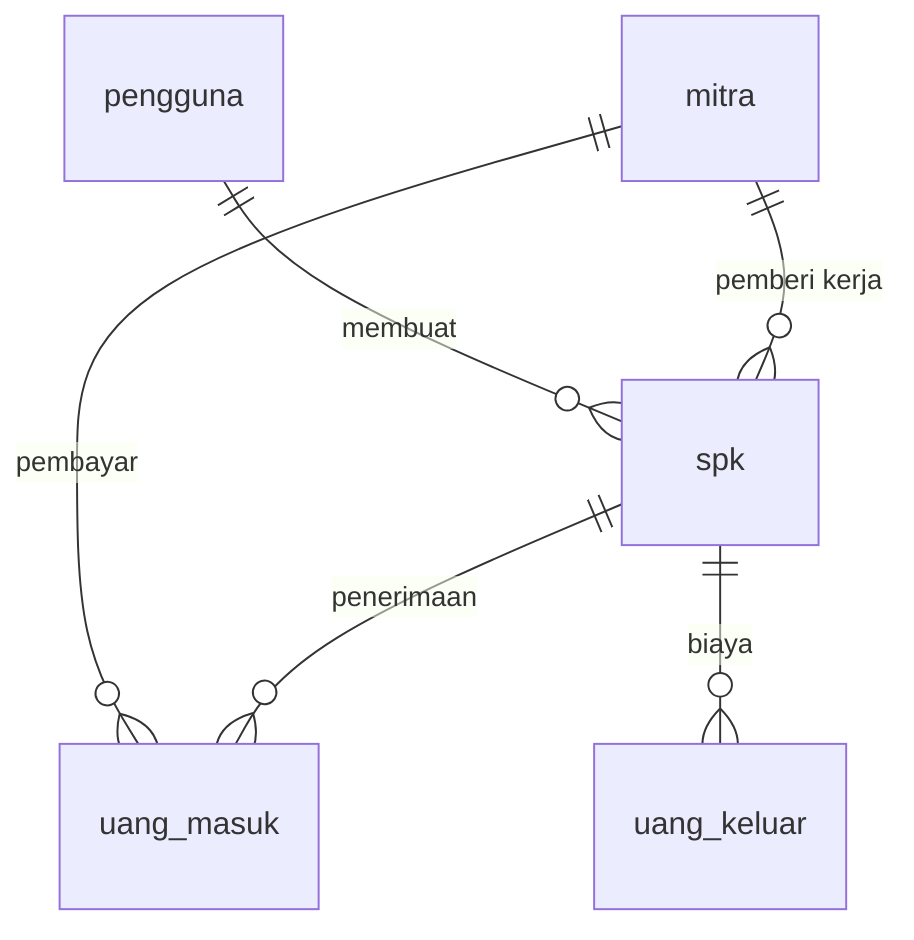

# Schema — Struktur Database (MySQL / MariaDB)
## Sistem Informasi SPK & Kontrol Keuangan — PT Barelang Kontraktor Sarana

> **Versi:** 3.1 — **5 TABEL** (sesuai `db.txt`)
> **Tanggal:** 19 September 2026
> **Menggantikan:** v3.0 — tersimpan di `docs-backup-29agu/Schema-v3.0.md`
> **Sumber:** `db.txt` + revisi user + keputusan user
> **Keputusan user:** MySQL · **full Laravel** · **5 tabel** · **tanpa `keterangan` di SPK** ·
> **tanpa audit log** · **jumlah file bukti bebas** · **deployment lokal (PC bisa dipakai kerja lain)**
>
> 📌 **Nama tabel & kolom memakai bahasa Indonesia**, sesuai `Rules.md` §4.

---

## 1. Keputusan yang Mengunci Schema Ini

| # | Keputusan | Dampak |
|---|---|---|
| 1 | **SPK adalah entitas inti. Tidak ada entitas PROYEK.** | Tidak ada tabel `proyek` |
| 2 | **Tidak ada Pengajuan Dana & Approval.** | Tidak ada tabel pengajuan |
| 3 | **`spk_id` dipertahankan di `uang_keluar`** (boleh NULL) | Laba-rugi per SPK dapat dihitung |
| 4 | **Tidak ada approval Direktur.** | Tidak ada field `disetujui_oleh` / `tanggal_persetujuan` |
| 5 | **SPK subkon/vendor masuk tabel `spk`** | Tidak ada tabel `subcon_spk` |
| 6 | **Tidak ada tabel `bukti`.** Bukti jadi kolom `bukti` di `uang_masuk` & `uang_keluar` | Jumlah file **bebas** (JSON array) |
| 7 | **Ikuti `db.txt` — 5 tabel** | Status & kategori jadi kolom + **PHP Enum** |
| 8 | **Kolom `keterangan` di `spk` DIHAPUS** | Keputusan user — tidak perlu |
| 9 | **Audit log DIHAPUS** | Keputusan user — tidak perlu. Menyimpang dari SRS NFR-SEC-004 |
| 10 | **MySQL + full Laravel** | Migration, Eloquent, validasi di aplikasi |
| 11 | **Deployment lokal**, PC boleh dipakai kerja lain | Lihat `Architecture.md` §7 |

## 2. Ringkasan Tabel (5 Tabel)

| No | Tabel | Fungsi |
|---|---|---|
| 1 | `pengguna` | Akun pengguna sistem (Admin, Direktur) |
| 2 | `mitra` | Pihak terkait: PLN, pelanggan, vendor, subkon |
| 3 | `spk` | ⭐ Entitas inti — data SPK |
| 4 | `uang_masuk` | Uang masuk (dari SPK / luar SPK) |
| 5 | `uang_keluar` | Uang keluar (terkait SPK / umum) |

## 3. Konvensi Umum

- Primary key: `BIGINT UNSIGNED` auto increment (konvensi Laravel).
- Foreign key: tipe **sama persis** dengan primary key yang dirujuk.
- Semua tabel operasional memiliki `created_at` dan `updated_at`.
- **Soft delete** (`deleted_at`) pada `spk`, `uang_masuk`, `uang_keluar`.
- **Nominal uang: `DECIMAL(18,2)`** — **DILARANG** `FLOAT`/`DOUBLE`.
- Unique constraint pada `spk.nomor_spk` dan `pengguna.email`.
- Index pada kolom yang sering difilter (status, tanggal, foreign key).
- **Nama tabel & kolom: bahasa Indonesia** (`Rules.md` §4).

## 4. DDL Lengkap

```sql
-- =========================================================
-- 1. pengguna
-- =========================================================
CREATE TABLE pengguna (
    id             BIGINT UNSIGNED PRIMARY KEY AUTO_INCREMENT,
    nama           VARCHAR(150) NOT NULL,
    email          VARCHAR(150) NOT NULL UNIQUE,
    password       VARCHAR(255) NOT NULL,
    peran          VARCHAR(50)  NOT NULL,        -- admin | direktur
    is_aktif       BOOLEAN DEFAULT TRUE,
    remember_token VARCHAR(100) NULL,
    created_at     TIMESTAMP NULL,
    updated_at     TIMESTAMP NULL
);
CREATE INDEX idx_pengguna_peran ON pengguna(peran);

-- =========================================================
-- 2. mitra
-- =========================================================
CREATE TABLE mitra (
    id         BIGINT UNSIGNED PRIMARY KEY AUTO_INCREMENT,
    nama       VARCHAR(200) NOT NULL,
    kategori   VARCHAR(50)  NOT NULL,   -- pln | pelanggan | vendor | subkon
    kontak     VARCHAR(100) NULL,
    alamat     VARCHAR(255) NULL,
    is_aktif   BOOLEAN DEFAULT TRUE,
    created_at TIMESTAMP NULL,
    updated_at TIMESTAMP NULL
);
CREATE INDEX idx_mitra_kategori ON mitra(kategori);

-- =========================================================
-- 3. spk  — ENTITAS INTI
-- =========================================================
CREATE TABLE spk (
    id             BIGINT UNSIGNED PRIMARY KEY AUTO_INCREMENT,
    nomor_spk      VARCHAR(150) NOT NULL UNIQUE,
    tanggal_spk    DATE NULL,                 -- NULL jika "TANPA SPK"
    tanggal_akhir  DATE NULL,                 -- 🆕 revisi db.txt: tanggal akhir SPK
    nama_pekerjaan VARCHAR(255) NOT NULL,
    lokasi         VARCHAR(255) NULL,
    nilai_spk      DECIMAL(18,2) NOT NULL,

    -- Retensi (untuk SPK subkon/vendor)
    -- ❌ KOLOM RETENSI DIHAPUS (19 Sep 2026) — perusahaan tidak menahan 5%.
    -- Migrasi: 2026_09_20_000003_hapus_retensi_dari_spk_table.php

    jenis_sumber   VARCHAR(50) NULL,          -- pln | luar | internal | lainnya
    sheet_lama     VARCHAR(100) NULL,         -- referensi sheet Excel lama
    mitra_id       BIGINT UNSIGNED NULL,      -- pemberi kerja
    status_spk     VARCHAR(50) NULL,          -- draft|terbit|berjalan|selesai|sudah_ditagihkan|dibatalkan
    status_tagihan VARCHAR(50) NULL,          -- belum_ditagihkan|sudah_ditagihkan|revisi_dokumen|menunggu_pembayaran|dibayar
    dibuat_oleh    BIGINT UNSIGNED NOT NULL,
    created_at     TIMESTAMP NULL,
    updated_at     TIMESTAMP NULL,
    deleted_at     TIMESTAMP NULL,

    CONSTRAINT fk_spk_mitra   FOREIGN KEY (mitra_id)   REFERENCES mitra(id),
    CONSTRAINT fk_spk_pembuat FOREIGN KEY (dibuat_oleh) REFERENCES pengguna(id),
    CONSTRAINT chk_spk_nilai  CHECK (nilai_spk >= 0)
);
CREATE INDEX idx_spk_nomor     ON spk(nomor_spk);
CREATE INDEX idx_spk_status    ON spk(status_spk);
CREATE INDEX idx_spk_tagihan   ON spk(status_tagihan);
CREATE INDEX idx_spk_tanggal   ON spk(tanggal_spk);
CREATE INDEX idx_spk_pekerjaan ON spk(nama_pekerjaan);
CREATE INDEX idx_spk_mitra     ON spk(mitra_id);

-- =========================================================
-- 4. uang_masuk
-- =========================================================
CREATE TABLE uang_masuk (
    id             BIGINT UNSIGNED PRIMARY KEY AUTO_INCREMENT,
    spk_id         BIGINT UNSIGNED NULL,      -- NULL = uang masuk dari LUAR SPK
    nomor_spk      VARCHAR(150) NULL,         -- 🆕 revisi db.txt
    nama_pekerjaan VARCHAR(255) NULL,         -- 🆕 revisi db.txt
    tanggal        DATE NOT NULL,
    jumlah         DECIMAL(18,2) NOT NULL,
    mitra_id       BIGINT UNSIGNED NULL,
    keterangan     TEXT NULL,
    bukti          JSON NULL,                 -- 🆕 jumlah file BEBAS (TF, gambar, PDF)
    created_at     TIMESTAMP NULL,
    updated_at     TIMESTAMP NULL,
    deleted_at     TIMESTAMP NULL,

    CONSTRAINT fk_masuk_spk     FOREIGN KEY (spk_id)   REFERENCES spk(id),
    CONSTRAINT fk_masuk_mitra   FOREIGN KEY (mitra_id) REFERENCES mitra(id),
    CONSTRAINT chk_masuk_jumlah CHECK (jumlah > 0)
);
CREATE INDEX idx_masuk_spk     ON uang_masuk(spk_id);
CREATE INDEX idx_masuk_tanggal ON uang_masuk(tanggal);

-- =========================================================
-- 5. uang_keluar
-- =========================================================
CREATE TABLE uang_keluar (
    id         BIGINT UNSIGNED PRIMARY KEY AUTO_INCREMENT,
    spk_id     BIGINT UNSIGNED NULL,          -- ✅ dipertahankan (keputusan #3)
    tanggal    DATE NOT NULL,
    jumlah     DECIMAL(18,2) NOT NULL,
    kategori   VARCHAR(100) NULL,             -- material|upah|operasional|gaji|nota|transportasi|lainnya
    penerima   VARCHAR(200) NULL,             -- nama vendor/subkon/staf
    keterangan TEXT NULL,
    bukti      JSON NULL,                     -- 🆕 jumlah file BEBAS (TF, gambar, PDF)
    created_at TIMESTAMP NULL,
    updated_at TIMESTAMP NULL,
    deleted_at TIMESTAMP NULL,

    CONSTRAINT fk_keluar_spk     FOREIGN KEY (spk_id) REFERENCES spk(id),
    CONSTRAINT chk_keluar_jumlah CHECK (jumlah > 0)
);
CREATE INDEX idx_keluar_spk      ON uang_keluar(spk_id);
CREATE INDEX idx_keluar_tanggal  ON uang_keluar(tanggal);
CREATE INDEX idx_keluar_kategori ON uang_keluar(kategori);
```

## 5. Perubahan dari `db.txt` (sesuai revisi & keputusan user)

### `spk`

| Field di `db.txt` | Status | Alasan |
|---|---|---|
| `pic` | ❌ **dihapus** | Revisi user: tidak digunakan |
| `keterangan` | ❌ **dihapus** | ✅ **Keputusan user: tidak perlu** |
| — | ✅ **ditambah** `tanggal_akhir` | Revisi user |

> 📌 **Catatan konsekuensi:** karena `keterangan` dihapus, catatan follow-up yang ada di setiap
> baris Excel (`27/7/2026 sudah diantar ke imperium`, `ada denda`, `PAKAI PT BKS`,
> `di potong 120.000 (uang material)`) **tidak punya tempat di sistem**.
> Jika nanti terasa perlu, kolom ini bisa ditambahkan kembali dengan satu migration.

### `uang_masuk`

| Field di `db.txt` | Status | Alasan |
|---|---|---|
| `nomor_transaksi` | ❌ dihapus | Revisi user |
| `sumber` | ❌ dihapus | Disimpulkan dari `spk_id` (ada = SPK, kosong = luar) |
| `metode_pembayaran` | ❌ dihapus | Revisi user |
| `status` | ❌ dihapus | Revisi user |
| `dicatat_oleh` | ❌ dihapus | Revisi user |
| — | ✅ **ditambah** `nama_pekerjaan`, `nomor_spk`, `bukti` | Revisi user |

**Form 2 mode (sesuai revisi user):**

| Mode | Field |
|---|---|
| **1. Berdasarkan SPK** | Dropdown list SPK + tanggal |
| **2. Manual** | Input `nama_pekerjaan` + `nomor_spk` bebas |

> 📌 `keterangan` **tetap ada** di `uang_masuk` (SRS: setiap transaksi perlu kolom keterangan).

### `uang_keluar`

| Field di `db.txt` | Status | Alasan |
|---|---|---|
| `nomor_transaksi` | ❌ dihapus | Revisi user |
| `mitra_id` | ❌ dihapus | Diganti `penerima` (teks) |
| `metode_pembayaran` | ❌ dihapus | Revisi user |
| `status` | ❌ dihapus | Revisi user |
| `dicatat_oleh` | ❌ dihapus | Revisi user |
| `disetujui_oleh` | ❌ **dihapus** | Keputusan #4 — tidak ada approval |
| `tanggal_persetujuan` | ❌ **dihapus** | Keputusan #4 — tidak ada approval |
| `spk_id` | ✅ **dipertahankan** | Keputusan #3 — wajib untuk laba-rugi per SPK |
| — | ✅ **ditambah** `bukti` | Revisi user |

### Tabel `bukti` — DIHAPUS

Bukti jadi kolom `bukti` bertipe **JSON** di `uang_masuk` & `uang_keluar`.
**Jumlah file bebas** — bisa 1, bisa 10, sesuai kebutuhan.

## 6. Kolom Turunan (Dihitung, Tidak Disimpan)

| Nilai | Rumus |
|---|---|
| **Total Uang Masuk** | `SUM(uang_masuk.jumlah)` |
| **Uang Masuk dari SPK** | `SUM(jumlah) WHERE spk_id IS NOT NULL` |
| **Uang Masuk dari Luar** | `SUM(jumlah) WHERE spk_id IS NULL` |
| **Total Uang Keluar** | `SUM(uang_keluar.jumlah)` |
| **Pengeluaran per Kategori** | `SUM(jumlah) GROUP BY kategori` |
| **Saldo Bersih** | Total Uang Masuk − Total Uang Keluar |
| **Total Nilai SPK** | `SUM(spk.nilai_spk)` |
| **Jumlah SPK per Status** | `COUNT(*) GROUP BY status_spk` |
| ~~Retensi SPK~~ | ❌ Tidak dipakai — kolom dihapus |
| **⭐ Nilai Tagih** | `nilai_spk − retensi_ditahan` |
| **⭐ Piutang Lancar** | `nilai_tagih − penerimaan` (**retensi TIDAK dihitung**) |
| **Sisa Hak Penuh** | `nilai_spk − penerimaan` (termasuk retensi) |
| **Penerimaan per SPK** | `SUM(uang_masuk.jumlah) WHERE spk_id = X` |
| **Biaya per SPK** | `SUM(uang_keluar.jumlah) WHERE spk_id = X` |
| **Estimasi Laba/Rugi per SPK** | Penerimaan per SPK − Biaya per SPK |
| **⭐ Umur Piutang** | `DATEDIFF(hari ini, tanggal_spk)` → kelompok `0-30`/`31-60`/`61-90`/`>90` |
| **⭐ Tenggat** | `DATEDIFF(tanggal_akhir, hari ini)` → lewat / ≤14 hari |

> ✅ **RETENSI TIDAK DIPAKAI** (diselaraskan 26 Sep 2026).
> Seluruh SPK yang berstatus `Dibayar` di data perusahaan diterima **100%** —
> tidak ada penahanan 5%. Karena itu:
>
> ```
> piutang = nilai_spk − sudah_diterima
> ```
>
> Kolom `persen_retensi` & `nilai_retensi` sudah **DIHAPUS** dari tabel `spk`.
> Rincian di `Rules.md` §2.

## 7. ⚠️ Risiko Desain 5 Tabel & Mitigasinya

Risiko ini **sudah dibuktikan** dengan uji di MariaDB 11.8 (dua skema, data identik).

### Bukti Risiko: Laporan Terpecah

| Tanggal | Kategori yang diketik | Jumlah |
|---|---|---|
| 01/07 | Material | 40.000.000 |
| 03/07 | Material Bangunan | 15.000.000 |
| 05/07 | Material2 *(typo)* | 5.000.000 |
| 12/07 | Upah | 25.000.000 |
| 14/07 | Upah Tukang | 10.000.000 |
| 20/07 | Operasional | 3.000.000 |

**Hasil pada skema kolom teks (5 tabel):**

| Kategori | Jml | Total |
|---|---|---|
| Material | 1 | 40.000.000 |
| Upah | 1 | 25.000.000 |
| Material Bangunan | 1 | 15.000.000 |
| Upah Tukang | 1 | 10.000.000 |
| Material2 | 1 | 5.000.000 |
| Operasional | 1 | 3.000.000 |

→ **6 baris.** Data "Material" terpecah 3, "Upah" terpecah 2. **Laporan salah.**

**Hasil pada skema master + FK (10 tabel):** 3 baris — Material 60 jt, Upah 35 jt. **Benar.**

### Daftar Risiko & Mitigasi

| # | Risiko | Berat | Mitigasi (full Laravel) |
|---|---|---|---|
| 1 | Laporan terpecah karena kategori ditulis berbeda | 🔴 Tinggi | **PHP Enum** + dropdown — Admin memilih, tidak mengetik |
| 2 | Typo status SPK → filter & laporan salah | 🔴 Tinggi | **PHP Enum** + `Rule::enum()` |
| 3 | Tambah status baru perlu `ALTER TABLE` | 🟡 Sedang | Terima, atau tambah nilai Enum + migration |
| 4 | Tidak ada proteksi di level database | 🟡 Sedang | **Form Request** + validasi enum |
| 5 | ~~Audit log tidak ada~~ | — | ✅ **Keputusan user: tidak perlu** |
| 6 | Storage sedikit lebih besar | 🟢 Rendah | Tidak perlu ditangani |

### Solusi Utama: PHP Enum (bawaan Laravel)

```php
<?php
declare(strict_types=1);

namespace App\Enums;

enum StatusSpk: string
{
    case Draft           = 'draft';
    case Terbit          = 'terbit';
    case Berjalan        = 'berjalan';
    case Selesai         = 'selesai';
    case SudahDitagihkan = 'sudah_ditagihkan';
    case Dibatalkan      = 'dibatalkan';

    public function label(): string
    {
        return match ($this) {
            self::Draft           => 'Draft',
            self::Terbit          => 'Terbit',
            self::Berjalan        => 'Berjalan',
            self::Selesai         => 'Selesai',
            self::SudahDitagihkan => 'Sudah Ditagihkan',
            self::Dibatalkan      => 'Dibatalkan',
        };
    }
}
```

**Model Eloquent:**

```php
protected function casts(): array
{
    return [
        'status_spk' => StatusSpk::class,
        'bukti'      => 'array',      // JSON array, jumlah file bebas
    ];
}
```

**Form Request (validasi):**

```php
'status_spk' => ['required', Rule::enum(StatusSpk::class)],
'kategori'   => ['required', Rule::enum(KategoriPengeluaran::class)],
'bukti'      => ['nullable', 'array'],
'bukti.*'    => ['file', 'mimes:jpg,jpeg,png,pdf', 'max:10240'],
```

**Form Blade (dropdown dari enum):**

```blade
<select name="status_spk">
    @foreach (App\Enums\StatusSpk::cases() as $s)
        <option value="{{ $s->value }}">{{ $s->label() }}</option>
    @endforeach
</select>
```

**Hasil:** Admin **tidak bisa** mengetik bebas → typo mustahil → laporan tetap konsisten,
**tanpa tabel master**. Menutup risiko #1, #2, dan #4.

## 8. ⚠️ Konsekuensi Audit Log Dihapus

Keputusan user: **audit log tidak perlu.** Konsekuensinya:

| Dampak | Penjelasan |
|---|---|
| **Menyimpang dari SRS NFR-SEC-004** | SRS mewajibkan *"setiap perubahan nominal & upload dokumen harus tercatat"* |
| Tidak ada jejak siapa mengubah nominal | Kalau ada selisih angka, sulit ditelusuri |
| Tidak ada rekam jejak penghapusan | Soft delete tetap ada, tapi tidak ada catatan siapa & kapan |
| Dokumen SRS perlu disesuaikan | Bagian NFR-SEC-004 harus diubah agar konsisten |

**Jika nanti diperlukan**, ada 2 cara menambah tanpa mengubah schema banyak:
1. **Package `spatie/laravel-activitylog`** — otomatis membuat tabelnya sendiri
2. Tambah tabel `log_aktivitas` — jadi 6 tabel

## 9. ⚠️ Satu Hal yang Masih Perlu Keputusan: Dokumen SPK

Karena tabel `bukti` dihapus dan bukti hanya di `uang_masuk` & `uang_keluar`,
**dokumen SPK tidak punya tempat penyimpanan** di sistem.

Padahal SRS mencantumkan upload pada form SPK: **scan SPK, kuitansi, BAST, BAAP, invoice, foto**.

**Kenapa ini penting:**

| Dokumen | Fungsi |
|---|---|
| Scan SPK | Bukti legal — SPK asli yang ditandatangani PLN |
| BAST | Bukti pekerjaan sudah diserahkan & diterima |
| BAAP | Bukti pekerjaan selesai |
| Kuitansi/Invoice | Bukti penagihan |
| Foto | Dokumentasi kondisi lapangan |

Sistem sudah mencatat *angka* (nilai SPK, status). Tapi angka **tidak membuktikan apa-apa** saat:
- PLN bilang "pekerjaan belum selesai" → butuh **BAST**
- Ada pemeriksaan pajak → butuh **scan SPK asli**
- Direktur mau verifikasi "SPK ini beneran ada?" → butuh **dokumen**

**Opsi:**

| Opsi | Dampak |
|---|---|
| **(a) Tambah kolom `dokumen` (JSON) di `spk`** | Tetap 5 tabel, +1 kolom. Konsisten dengan pola `bukti` |
| **(b) Tidak ada** | Dokumen SPK disimpan di luar sistem (lemari arsip / folder manual) |

**Rekomendasi saya: opsi (a)** — biayanya hanya 1 kolom.

## 10. Rencana Migrasi Data dari Excel

| Sumber Data Lama | Target | Aturan |
|---|---|---|
| Daftar SPK dari banyak sheet | `spk` | Semua SPK disatukan; sheet lama → `sheet_lama` |
| Uang masuk dari SPK | `uang_masuk` | `spk_id` **wajib** diisi |
| Uang masuk dari luar SPK | `uang_masuk` | `spk_id` kosong |
| Uang keluar terkait SPK | `uang_keluar` | `spk_id` diisi |
| Uang keluar umum | `uang_keluar` | `spk_id` kosong |
| Daftar user | `pengguna` | Hanya `admin` atau `direktur` |

### ⚠️ Kualitas Data Referensi SPK

| Masalah | Jumlah |
|---|---|
| Record **tanpa nomor SPK** | 14 |
| Record **tanpa tanggal** | 14 |
| Record **tanpa dokumen** | 91 (seluruhnya) |
| **Nomor SPK duplikat** | Ada |

**Urutan wajib sebelum import production:**
`cleansing` → `deduplikasi` → `rekonsiliasi nilai` → `validasi sampel` →
tetapkan `nomor_spk` sebagai unique key.

## 11. Output Laporan

| Laporan | Sumber Data | Tujuan |
|---|---|---|
| Laporan SPK | `spk` | Daftar SPK, nilai, status, tagihan |
| Laporan Uang Masuk | `uang_masuk` | Seluruh penerimaan dari SPK & luar SPK |
| Laporan Uang Keluar | `uang_keluar` | Seluruh pengeluaran per kategori & periode |
| Laporan Cashflow | `uang_masuk` + `uang_keluar` | Perbandingan masuk vs keluar per periode |
| Laporan SPK Belum Dibayar | `spk` + `uang_masuk` | Selisih nilai SPK vs pembayaran diterima |
| **Laporan Laba-Rugi per SPK** | `spk` + `uang_masuk` + `uang_keluar` | Penerimaan − biaya ⭐ |

## 12. Jalur Pivot ke 10 Tabel (Nanti)

Karena user menyebut *"nanti kedepannya baru pivot ke lain"*, berikut jalurnya —
**tanpa membuang data**:

| Langkah | Aksi |
|---|---|
| 1 | Buat tabel master: `status_spk`, `status_tagihan`, `kategori_pengeluaran` |
| 2 | Isi dari nilai distinct: `INSERT INTO status_spk SELECT DISTINCT status_spk FROM spk` |
| 3 | Tambah kolom FK: `ALTER TABLE spk ADD COLUMN status_spk_id BIGINT UNSIGNED NULL` |
| 4 | Isi FK: `UPDATE spk s JOIN status_spk m ON m.nama = s.status_spk SET s.status_spk_id = m.id` |
| 5 | Hapus kolom lama: `ALTER TABLE spk DROP COLUMN status_spk` |
| 6 | Tambah foreign key constraint |
| 7 | Ubah Enum → relasi Eloquent (`belongsTo`) |

**Yang memudahkan pivot:** karena Enum dipakai sejak awal, nilai di database **sudah konsisten**
(`draft`, `terbit`, `berjalan`, ...) — jadi langkah 2 & 4 bersih tanpa duplikasi/typo.

> ⚠️ Kalau sejak awal pakai teks bebas tanpa Enum, pivot akan berantakan karena data
> sudah terpecah dan harus dibersihkan manual.

## 13. Relasi (ERD Tekstual)

```
pengguna
  └── hasMany spk          (dibuat_oleh)

mitra
  ├── hasMany spk          (mitra_id — pemberi kerja)
  └── hasMany uang_masuk   (mitra_id — pembayar)

spk
  ├── belongsTo pengguna   (dibuat_oleh)
  ├── belongsTo mitra      (mitra_id)
  ├── hasMany uang_masuk   (spk_id, nullable)
  └── hasMany uang_keluar  (spk_id, nullable)

uang_masuk
  ├── belongsTo spk        (nullable)
  └── belongsTo mitra      (nullable)

uang_keluar
  └── belongsTo spk        (nullable)
```



## 14. Aturan Integritas

1. `jumlah` **harus > 0**; `nilai_spk` **harus ≥ 0**.
2. Arah transaksi ditentukan oleh **tabel** (`uang_masuk`/`uang_keluar`), bukan tanda minus.
3. **Sumber uang masuk disimpulkan dari `spk_id`:**
   - `spk_id` **terisi** → uang masuk dari SPK
   - `spk_id` **NULL** → uang masuk dari luar SPK
4. Uang keluar terkait SPK → `spk_id` diisi; pengeluaran umum → `spk_id` boleh `NULL`.
5. **`status_spk`, `status_tagihan`, `kategori`, `jenis_sumber`, `peran`, `mitra.kategori`
   WAJIB divalidasi memakai PHP Enum** — tidak boleh teks bebas (mitigasi risiko §7).
6. Histori keuangan **tidak boleh dihapus fisik** — gunakan soft delete.
7. `nomor_spk` **unique** — tetapi data Excel punya **nomor SPK duplikat** & **14 record tanpa
   nomor SPK**. Wajib *cleansing* sebelum import.
8. Operasi yang mengubah beberapa tabel wajib memakai `DB::transaction`.

---

## 15. Ringkasan Perubahan v3.1

| Aspek | v3.0 | v3.1 |
|---|---|---|
| Kolom `keterangan` di `spk` | Ada (dipertahankan sementara) | ❌ **Dihapus** |
| Audit log | Opsi package `spatie` | ❌ **Dihapus** (menyimpang dari SRS) |
| Jumlah file bukti | JSON array | ✅ **Bebas** (dikonfirmasi) |
| Deployment | Lokal | ✅ Lokal, **PC boleh dipakai kerja lain** |
| Kolom `dokumen` di `spk` | — | ⏳ **Menunggu keputusan** (§9) |

---

*Schema v3.1 — keputusan user 19 September 2026 sudah diterapkan.
Versi v3.0 di `docs-backup-29agu/Schema-v3.0.md` · v2.2 (10 tabel) di
`docs-backup-29agu/Schema-v2.2-10tabel.md` · v1.0 di `docs-backup-29agu/Schema.md`.*
