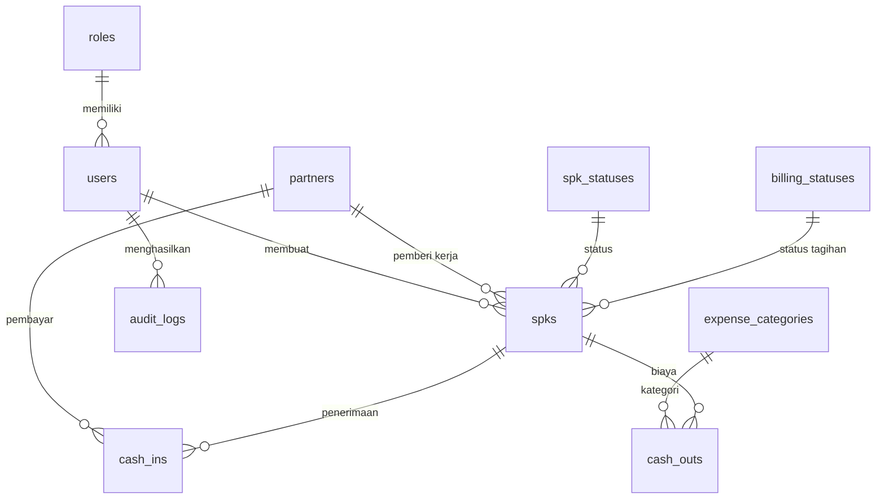

# Schema — Struktur Database (MySQL / MariaDB)
## Sistem Informasi SPK & Kontrol Keuangan — PT Barelang Kontraktor Sarana

> **Versi:** 2.2
> **Tanggal:** 19 September 2026
> **Menggantikan:** `docs-backup-29agu/Schema.md` (v1.0) dan draf v2.0/v2.1
> **Sumber:** SRS (BAB III) + `db.txt` + **keputusan user 19 Sep 2026**
> **Status:** Siap untuk migration, kecuali 3 hal di §9
>
> 📌 **v2.2 menambahkan §3.1 Ketertelusuran Tabel** — penjelasan terbuka bahwa `db.txt`
> hanya memuat 5 tabel, sedangkan schema ini memuat 10 (5 tambahan dari 3NF SRS).

---

## 1. Keputusan Arsitektur Data (Final)

Keputusan yang mengunci bentuk schema ini:

| # | Keputusan | Dampak |
|---|---|---|
| 1 | **SPK adalah entitas inti. Tidak ada entitas PROYEK.** | Tabel `projects` **dihapus** |
| 2 | **Tidak ada modul Pengajuan Dana & Approval.** | Tabel `cash_requests` **dihapus**, tidak ada alur approval |
| 3 | **Uang keluar tetap terhubung ke SPK** (`spk_id` nullable) | Laba-rugi per SPK dapat dihitung |
| 4 | **Tidak ada approval Direktur pada uang keluar.** | Field `disetujui_oleh` & `tanggal_persetujuan` **dihapus** |
| 5 | **SPK subkon/vendor dilebur ke tabel `spks`.** | Tabel `subcon_spks` **dihapus** |
| 6 | **Tidak ada tabel bukti terpisah.** Bukti disimpan sebagai kolom di tabel yang memerlukannya. | Tabel `attachments` + `attachment_types` **dihapus** |

## 2. Konvensi Umum

- Primary key: `BIGINT UNSIGNED` auto increment (konvensi Laravel).
- Foreign key: tipe **sama persis** dengan primary key yang dirujuk.
- Semua tabel operasional memiliki `created_at` dan `updated_at`.
- **Soft delete** (`deleted_at`) pada `spks`, `cash_ins`, `cash_outs`.
- **Nominal uang: `DECIMAL(18,2)`** — **DILARANG** `FLOAT`/`DOUBLE`.
- Unique constraint pada `spk_number` dan `email`.
- Index pada kolom yang sering difilter (status, tanggal, foreign key).
- Normalisasi sampai **3NF** — data referensi dipisahkan ke tabel master.

## 3. Ringkasan Tabel (10 tabel)

### Tabel Master (6)

| No | Tabel | Fungsi |
|---|---|---|
| 1 | `roles` | Role pengguna: Admin, Direktur |
| 2 | `users` | Akun pengguna sistem |
| 3 | `partners` | Pihak terkait: PLN, pelanggan, vendor, subkon |
| 4 | `spk_statuses` | Status SPK: Draft, Terbit, Berjalan, Selesai, Sudah Ditagihkan, Dibatalkan |
| 5 | `billing_statuses` | Status tagihan SPK |
| 6 | `expense_categories` | Kategori uang keluar |

### Tabel Transaksi (3)

| No | Tabel | Fungsi |
|---|---|---|
| 7 | `spks` | ⭐ Entitas inti — data SPK |
| 8 | `cash_ins` | Uang masuk (dari SPK / luar SPK) |
| 9 | `cash_outs` | Uang keluar (terkait SPK / umum) |

### Tabel Log (1)

| No | Tabel | Fungsi |
|---|---|---|
| 10 | `audit_logs` | Riwayat aktivitas & perubahan data |

### Tabel yang Dihapus dari Desain Sebelumnya

| Tabel | Alasan dihapus |
|---|---|
| `projects` | Keputusan #1 — tidak ada entitas PROYEK |
| `subcon_spks` | Keputusan #5 — dilebur ke `spks` |
| `cash_requests` | Keputusan #2 — tidak ada pengajuan dana |
| `attachments` | Keputusan #6 — bukti jadi kolom di tabel transaksi |
| `attachment_types` | Ikut terhapus bersama `attachments` |
| `income_sources` | Tidak diperlukan — sumber uang masuk disimpulkan dari `spk_id` (ada = SPK, kosong = luar SPK) |
| `payment_methods` | Revisi `db.txt`: `metode_pembayaran` tidak digunakan pada uang masuk & uang keluar |

## 3.1 Ketertelusuran Tabel — `db.txt` vs Tambahan

> ⚠️ **Transparansi penting:** `db.txt` hanya memuat **6 tabel** (setelah revisi user → **5 tabel**).
> Schema final di dokumen ini berisi **10 tabel**. **5 tabel tambahan** diambil dari desain
> **3NF pada SRS (BAB III)**. Bagian ini mencatat asal setiap tabel agar tidak ada yang tersembunyi.

### Berasal dari `db.txt` (5 tabel)

| `db.txt` | Nama di schema final | Catatan |
|---|---|---|
| `pengguna` | `users` | + kolom `role_id`, `is_active`, `remember_token` |
| `mitra` | `partners` | + kolom `address`, `is_active` |
| `spk` | `spks` | + `end_date`, `retention_*`, `old_sheet_name`, FK status; − `pic`, − `keterangan` (menunggu keputusan) |
| `uang_masuk` | `cash_ins` | − `nomor_transaksi`, − `sumber`, − `metode_pembayaran`, − `status`, − `dicatat_oleh`; + `nama_pekerjaan`, `nomor_spk`, `bukti` |
| `uang_keluar` | `cash_outs` | − `nomor_transaksi`, − `mitra_id`, − `metode_pembayaran`, − `status`, − `dicatat_oleh`, − `disetujui_oleh`, − `tanggal_persetujuan`; + `bukti`; **`spk_id` dipertahankan** |
| ~~`bukti`~~ | — | **Dihapus** sesuai revisi user — bukti jadi kolom `bukti` di `cash_ins` & `cash_outs` |

### Tambahan dari SRS / praktik terbaik (5 tabel)

| Tabel tambahan | Menggantikan apa di `db.txt` | Alasan |
|---|---|---|
| `roles` | kolom `pengguna.peran` | SRS §3.A.3 — *"Agar hak akses tidak hardcode di tabel users"* |
| `spk_statuses` | kolom `spk.status_spk` | SRS §3.A.3 — *"Agar status Terbit, Berjalan, Selesai bisa dikelola sebagai master data"* |
| `billing_statuses` | kolom `spk.status_tagihan` | SRS §3.A.3 — *"Agar status pembayaran/tagihan tidak berulang sebagai teks"* |
| `expense_categories` | kolom `uang_keluar.kategori` | SRS §3.A.3 — *"Agar laporan pengeluaran konsisten"* |
| `audit_logs` | ❌ **tidak ada di `db.txt`** | SRS NFR-SEC-004 — *"Setiap perubahan nominal & upload dokumen harus tercatat"* |

### Konsekuensi Pilihan Ini

| Aspek | Dampak |
|---|---|
| **Nama tabel** | Memakai bahasa Inggris (`users`, `spks`, `cash_ins`) — konvensi Laravel. `db.txt` memakai bahasa Indonesia |
| **Nama kolom** | Memakai bahasa Inggris (`spk_value`, `cash_ins.jumlah`) — konsisten dengan konvensi framework |
| **Menambah status/kategori baru** | Cukup tambah **data** di tabel master — **tanpa** migration baru |
| **Kompleksitas** | Perlu seed data master & relasi FK tambahan saat implementasi |
| **Kesesuaian SRS** | Sesuai SRS §3.A.3 & §3.0.5 (*"rancangan final harus menggunakan tabel master dan foreign key"*) |

> 📌 SRS §3.0.5 secara eksplisit menyatakan: *"Database produksi tidak menggunakan desain
> semi-normalized sebagai desain final. Pendekatan semi-normalized hanya cocok untuk prototipe
> cepat, bukan untuk sistem yang akan dikembangkan jangka panjang."*
>
> **Jika Anda ingin schema diringkas ke 5 tabel** (mengikuti `db.txt` apa adanya, status/kategori
> jadi kolom biasa), struktur ini bisa diubah — cukup beri tahu.

## 4. DDL Tabel Master

```sql
-- =========================================================
-- 1. roles
-- =========================================================
CREATE TABLE roles (
    id          BIGINT UNSIGNED PRIMARY KEY AUTO_INCREMENT,
    name        VARCHAR(50)  NOT NULL UNIQUE,   -- admin, direktur
    label       VARCHAR(100) NOT NULL,
    created_at  TIMESTAMP NULL,
    updated_at  TIMESTAMP NULL
);

-- =========================================================
-- 2. users
-- =========================================================
CREATE TABLE users (
    id              BIGINT UNSIGNED PRIMARY KEY AUTO_INCREMENT,
    name            VARCHAR(150) NOT NULL,
    email           VARCHAR(150) NOT NULL UNIQUE,
    password        VARCHAR(255) NOT NULL,
    role_id         BIGINT UNSIGNED NOT NULL,
    is_active       BOOLEAN DEFAULT TRUE,
    remember_token  VARCHAR(100) NULL,
    created_at      TIMESTAMP NULL,
    updated_at      TIMESTAMP NULL,
    CONSTRAINT fk_users_role FOREIGN KEY (role_id) REFERENCES roles(id)
);
CREATE INDEX idx_users_role ON users(role_id);

-- =========================================================
-- 3. partners  (mitra)
-- =========================================================
CREATE TABLE partners (
    id          BIGINT UNSIGNED PRIMARY KEY AUTO_INCREMENT,
    name        VARCHAR(200) NOT NULL,
    category    VARCHAR(50)  NOT NULL,   -- pln, pelanggan, vendor, subkon
    contact     VARCHAR(100) NULL,
    address     VARCHAR(255) NULL,
    is_active   BOOLEAN DEFAULT TRUE,
    created_at  TIMESTAMP NULL,
    updated_at  TIMESTAMP NULL
);
CREATE INDEX idx_partners_category ON partners(category);

-- =========================================================
-- 4. spk_statuses
-- =========================================================
CREATE TABLE spk_statuses (
    id          BIGINT UNSIGNED PRIMARY KEY AUTO_INCREMENT,
    code        VARCHAR(50)  NOT NULL UNIQUE,
    -- draft, terbit, berjalan, selesai, sudah_ditagihkan, dibatalkan
    label       VARCHAR(100) NOT NULL,
    sort_order  INT DEFAULT 0,
    created_at  TIMESTAMP NULL,
    updated_at  TIMESTAMP NULL
);

-- =========================================================
-- 5. billing_statuses
-- =========================================================
CREATE TABLE billing_statuses (
    id          BIGINT UNSIGNED PRIMARY KEY AUTO_INCREMENT,
    code        VARCHAR(50)  NOT NULL UNIQUE,
    -- belum_ditagihkan, sudah_ditagihkan, revisi_dokumen, menunggu_pembayaran, dibayar
    label       VARCHAR(100) NOT NULL,
    sort_order  INT DEFAULT 0,
    created_at  TIMESTAMP NULL,
    updated_at  TIMESTAMP NULL
);

-- =========================================================
-- 6. expense_categories
-- =========================================================
CREATE TABLE expense_categories (
    id          BIGINT UNSIGNED PRIMARY KEY AUTO_INCREMENT,
    code        VARCHAR(50)  NOT NULL UNIQUE,
    -- gaji, nota, operasional, material, vendor_subkon, upah, transportasi, lainnya
    label       VARCHAR(100) NOT NULL,
    is_active   BOOLEAN DEFAULT TRUE,
    created_at  TIMESTAMP NULL,
    updated_at  TIMESTAMP NULL
);
```

## 5. DDL Tabel Transaksi

### 5.1 `spks` — entitas inti

Semua SPK (PLN maupun subkon/vendor) disatukan dalam **satu tabel**. Informasi asal dari
Excel disimpan pada `old_sheet_name` sebagai referensi — **bukan** tabel terpisah per sheet.

```sql
CREATE TABLE spks (
    id                   BIGINT UNSIGNED PRIMARY KEY AUTO_INCREMENT,
    spk_number           VARCHAR(150) NOT NULL UNIQUE,
    spk_date             DATE NULL,                 -- NULL jika "TANPA SPK"
    end_date             DATE NULL,                 -- 🆕 tanggal akhir SPK (revisi db.txt)
    work_name            VARCHAR(255) NOT NULL,
    location             VARCHAR(255) NULL,
    spk_value            DECIMAL(18,2) NOT NULL,
    source_type          VARCHAR(50) NULL,          -- pln, luar, internal, lainnya
    old_sheet_name       VARCHAR(100) NULL,         -- referensi sheet Excel lama
    partner_id           BIGINT UNSIGNED NULL,      -- pemberi kerja (PLN / pelanggan)
    spk_status_id        BIGINT UNSIGNED NULL,
    billing_status_id    BIGINT UNSIGNED NULL,

    -- Retensi (untuk SPK subkon/vendor)
    retention_percentage DECIMAL(5,2)  NULL,        -- default 5.00
    retention_amount     DECIMAL(18,2) NULL,        -- = spk_value * retention_percentage / 100

    description          TEXT NULL,                 -- ⚠️ lihat §9 catatan 1
    created_by           BIGINT UNSIGNED NOT NULL,
    created_at           TIMESTAMP NULL,
    updated_at           TIMESTAMP NULL,
    deleted_at           TIMESTAMP NULL,

    CONSTRAINT fk_spks_partner FOREIGN KEY (partner_id)        REFERENCES partners(id),
    CONSTRAINT fk_spks_status  FOREIGN KEY (spk_status_id)     REFERENCES spk_statuses(id),
    CONSTRAINT fk_spks_billing FOREIGN KEY (billing_status_id) REFERENCES billing_statuses(id),
    CONSTRAINT fk_spks_creator FOREIGN KEY (created_by)        REFERENCES users(id),
    CONSTRAINT chk_spks_value  CHECK (spk_value >= 0)
);
CREATE INDEX idx_spks_number   ON spks(spk_number);
CREATE INDEX idx_spks_status   ON spks(spk_status_id);
CREATE INDEX idx_spks_billing  ON spks(billing_status_id);
CREATE INDEX idx_spks_date     ON spks(spk_date);
CREATE INDEX idx_spks_work     ON spks(work_name);
CREATE INDEX idx_spks_partner  ON spks(partner_id);
```

> **Atribut yang TIDAK digunakan pada `spks`** (sesuai revisi `db.txt`):
> `pic` ❌ dan `keterangan` ❌
>
> **Atribut yang DITAMBAHKAN:** `end_date` (tanggal akhir SPK) ✅
>
> ⚠️ `description` **saya pertahankan** meskipun `db.txt` meminta dihapus — lihat §9 catatan 1.

### 5.2 `cash_ins` — uang masuk

Dua alur: **dari SPK** (`spk_id` diisi) atau **luar SPK** (`spk_id` kosong).
Tidak perlu kolom `sumber` — sumber disimpulkan dari ada/tidaknya `spk_id`.

```sql
CREATE TABLE cash_ins (
    id               BIGINT UNSIGNED PRIMARY KEY AUTO_INCREMENT,
    spk_id           BIGINT UNSIGNED NULL,      -- NULL = uang masuk dari luar SPK
    nomor_spk        VARCHAR(150) NULL,         -- 🆕 revisi db.txt
    nama_pekerjaan   VARCHAR(255) NULL,         -- 🆕 revisi db.txt
    tanggal          DATE NOT NULL,
    jumlah           DECIMAL(18,2) NOT NULL,
    partner_id       BIGINT UNSIGNED NULL,      -- mitra/pembayar
    keterangan       TEXT NULL,
    bukti            JSON NULL,                 -- 🆕 array path file (TF, gambar, PDF)
    created_at       TIMESTAMP NULL,
    updated_at       TIMESTAMP NULL,
    deleted_at       TIMESTAMP NULL,

    CONSTRAINT fk_cashins_spk     FOREIGN KEY (spk_id)     REFERENCES spks(id),
    CONSTRAINT fk_cashins_partner FOREIGN KEY (partner_id) REFERENCES partners(id),
    CONSTRAINT chk_cashins_amount CHECK (jumlah > 0)
);
CREATE INDEX idx_cashins_spk     ON cash_ins(spk_id);
CREATE INDEX idx_cashins_tanggal ON cash_ins(tanggal);
```

**Atribut yang TIDAK digunakan** (revisi `db.txt`):
`nomor_transaksi` ❌, `sumber` ❌, `metode_pembayaran` ❌, `status` ❌, `dicatat_oleh` ❌

**Atribut yang DITAMBAHKAN:** `nama_pekerjaan` ✅, `nomor_spk` ✅, `bukti` ✅

**Catatan form — 2 mode dropdown:**

| Mode | Field |
|---|---|
| **1. Berdasarkan SPK** | Dropdown list SPK (searchable) + tanggal |
| **2. Manual** | Input `nama_pekerjaan` + `nomor_spk` bebas |

### 5.3 `cash_outs` — uang keluar

```sql
CREATE TABLE cash_outs (
    id                   BIGINT UNSIGNED PRIMARY KEY AUTO_INCREMENT,
    spk_id               BIGINT UNSIGNED NULL,   -- ✅ dipertahankan (keputusan #3)
    tanggal              DATE NOT NULL,
    jumlah               DECIMAL(18,2) NOT NULL,
    expense_category_id  BIGINT UNSIGNED NULL,
    penerima             VARCHAR(200) NULL,      -- nama vendor/subkon/staf
    keterangan           TEXT NULL,
    bukti                JSON NULL,              -- 🆕 array path file (TF, gambar, PDF)
    created_at           TIMESTAMP NULL,
    updated_at           TIMESTAMP NULL,
    deleted_at           TIMESTAMP NULL,

    CONSTRAINT fk_cashouts_spk FOREIGN KEY (spk_id)              REFERENCES spks(id),
    CONSTRAINT fk_cashouts_cat FOREIGN KEY (expense_category_id) REFERENCES expense_categories(id),
    CONSTRAINT chk_cashouts_amount CHECK (jumlah > 0)
);
CREATE INDEX idx_cashouts_spk     ON cash_outs(spk_id);
CREATE INDEX idx_cashouts_tanggal ON cash_outs(tanggal);
CREATE INDEX idx_cashouts_cat     ON cash_outs(expense_category_id);
```

**Atribut yang TIDAK digunakan** (revisi `db.txt` + keputusan #4):
`nomor_transaksi` ❌, `mitra_id` ❌ (pakai `penerima`), `metode_pembayaran` ❌,
`status` ❌, `dicatat_oleh` ❌, `disetujui_oleh` ❌, `tanggal_persetujuan` ❌

**Atribut yang DITAMBAHKAN:** `bukti` (TF, gambar, PDF) ✅

**Atribut yang DIPERTAHANKAN:** `spk_id` ✅ — sesuai keputusan #3
(*"tambahkan saja kalau memang wajib"*). **Wajib** dipertahankan agar laba-rugi per SPK
bisa dihitung: tanpa `spk_id`, biaya tidak bisa diatribusikan ke SPK mana pun.

> **Tidak ada approval.** Uang keluar langsung tercatat, tanpa persetujuan Direktur
> (keputusan #4).

### 5.4 `audit_logs`

```sql
CREATE TABLE audit_logs (
    id           BIGINT UNSIGNED PRIMARY KEY AUTO_INCREMENT,
    user_id      BIGINT UNSIGNED NULL,
    action       VARCHAR(150) NOT NULL,   -- create, update, delete, upload
    table_name   VARCHAR(100) NOT NULL,
    record_id    BIGINT UNSIGNED NULL,
    old_value    JSON NULL,
    new_value    JSON NULL,
    description  TEXT NULL,
    ip_address   VARCHAR(45) NULL,
    user_agent   VARCHAR(255) NULL,
    created_at   TIMESTAMP NULL,

    CONSTRAINT fk_logs_user FOREIGN KEY (user_id) REFERENCES users(id)
);
CREATE INDEX idx_logs_table  ON audit_logs(table_name, record_id);
CREATE INDEX idx_logs_user   ON audit_logs(user_id);
CREATE INDEX idx_logs_action ON audit_logs(action);
```

## 6. Kolom Turunan (Dihitung, Tidak Disimpan)

Semua nilai berikut dihitung *on-the-fly* agar tidak terjadi data tidak sinkron.

| Nilai | Rumus |
|---|---|
| **Total Uang Masuk** | `SUM(cash_ins.jumlah)` |
| **Uang Masuk dari SPK** | `SUM(jumlah) WHERE spk_id IS NOT NULL` |
| **Uang Masuk dari Luar** | `SUM(jumlah) WHERE spk_id IS NULL` |
| **Total Uang Keluar** | `SUM(cash_outs.jumlah)` |
| **Pengeluaran per Kategori** | `SUM(jumlah) GROUP BY expense_category_id` |
| **Saldo Bersih** | Total Uang Masuk − Total Uang Keluar |
| **Total Nilai SPK** | `SUM(spks.spk_value)` |
| **Jumlah SPK per Status** | `COUNT(*) GROUP BY spk_status_id` |
| **Retensi SPK** | `spk_value × retention_percentage / 100` |
| **Nilai Bersih SPK** | `spk_value − retention_amount` |
| **Penerimaan per SPK** | `SUM(cash_ins.jumlah) WHERE spk_id = X` |
| **Biaya per SPK** | `SUM(cash_outs.jumlah) WHERE spk_id = X` |
| **Piutang per SPK** | `spk_value − penerimaan SPK tersebut` |
| **Estimasi Laba/Rugi per SPK** | Penerimaan per SPK − Biaya per SPK |

## 7. Relasi (ERD Tekstual)

```
roles
  └── hasMany users

users
  ├── hasMany spks        (created_by)
  └── hasMany audit_logs  (user_id)

partners
  ├── hasMany spks        (partner_id — pemberi kerja)
  └── hasMany cash_ins    (partner_id — pembayar)

spk_statuses
  └── hasMany spks

billing_statuses
  └── hasMany spks

expense_categories
  └── hasMany cash_outs

spks
  ├── belongsTo users              (created_by)
  ├── belongsTo partners           (partner_id)
  ├── belongsTo spk_statuses       (spk_status_id)
  ├── belongsTo billing_statuses   (billing_status_id)
  ├── hasMany cash_ins             (spk_id, nullable)
  └── hasMany cash_outs            (spk_id, nullable)

cash_ins
  ├── belongsTo spks      (nullable)
  └── belongsTo partners  (nullable)

cash_outs
  ├── belongsTo spks                (nullable)
  └── belongsTo expense_categories  (nullable)

audit_logs
  └── belongsTo users
```



## 8. Aturan Integritas

1. `jumlah` dan `spk_value` **harus ≥ 0**; `jumlah` pada transaksi **harus > 0**.
2. Arah transaksi ditentukan oleh **tabel** (`cash_ins`/`cash_outs`), bukan tanda minus.
3. **Sumber uang masuk disimpulkan dari `spk_id`:**
   - `spk_id` **terisi** → uang masuk dari SPK
   - `spk_id` **NULL** → uang masuk dari luar SPK
4. Uang keluar terkait SPK → `spk_id` diisi; pengeluaran umum → `spk_id` boleh `NULL`.
5. Setiap transaksi **wajib** memiliki kategori yang valid.
6. Histori keuangan **tidak boleh dihapus fisik** — gunakan soft delete.
7. `spk_number` **unique** — tetapi data Excel saat ini punya **nomor SPK duplikat** dan
   **14 record tanpa nomor SPK**. Wajib *cleansing* sebelum import.
8. Operasi yang mengubah beberapa tabel wajib memakai `DB::transaction`.

## 9. ⚠️ 3 Hal yang Masih Perlu Konfirmasi

### 1. Kolom `keterangan` pada SPK

- **Revisi `db.txt`:** `pic` dan `keterangan` **tidak digunakan** pada tabel `spk`.
- **SRS:** *"Setiap transaksi perlu kolom keterangan... wajib tersedia pada SPK, uang masuk,
  uang keluar..."*
- **Data Excel:** **setiap baris** punya catatan seperti `27/7/2026 sudah diantar ke imperium`,
  `ada denda`, `PAKAI PT BKS`, `di potong 120.000 (uang material)`.

**Saya pertahankan `description`** pada `spks` karena menghapusnya berarti kehilangan catatan
follow-up yang ada di setiap baris Excel. **Mohon konfirmasi: hapus atau pertahankan?**

### 2. Dokumen SPK (BAST, kuitansi, scan SPK) tidak punya tempat

Karena tabel `attachments` dihapus dan bukti hanya ada di uang masuk & uang keluar,
dokumen SPK **tidak bisa diunggah**. Padahal SRS mencantumkan *"Upload SPK, kuitansi, BAST,
BAAP, invoice, foto"* pada form SPK.

**Opsi:**
- **(a)** Tambahkan kolom `dokumen` (JSON) pada `spks` — konsisten dengan pola `bukti`.
- **(b)** Terima bahwa dokumen SPK disimpan di luar sistem (folder manual).

**Rekomendasi saya: opsi (a)** — satu kolom JSON, tanpa tabel baru.

### 3. Format penyimpanan bukti

`bukti` disimpan sebagai **JSON array path** di `cash_ins` dan `cash_outs`, agar bisa
menampung lebih dari satu file (mis. bukti transfer + nota) tanpa tabel tambahan.

Jika Anda hanya butuh **satu file per transaksi**, kolom bisa diubah jadi `VARCHAR(255)` biasa.
**Mohon konfirmasi: satu file atau banyak file?**

## 10. Rencana Migrasi Data dari Excel

| Sumber Data Lama | Target | Aturan |
|---|---|---|
| Daftar SPK dari banyak sheet | `spks` | Semua SPK disatukan; sheet lama → `old_sheet_name` |
| Uang masuk dari SPK | `cash_ins` | `spk_id` **wajib** diisi |
| Uang masuk dari luar SPK | `cash_ins` | `spk_id` kosong |
| Uang keluar terkait SPK | `cash_outs` | `spk_id` diisi |
| Uang keluar umum | `cash_outs` | `spk_id` kosong |
| Daftar user | `users` | Hanya `admin` atau `direktur` |

### ⚠️ Kualitas Data Referensi SPK

| Masalah | Jumlah |
|---|---|
| Record **tanpa nomor SPK** | 14 |
| Record **tanpa tanggal** | 14 |
| Record **tanpa dokumen** | 91 (seluruhnya) |
| **Nomor SPK duplikat** | Ada |

**Urutan wajib sebelum import production:**
`cleansing` → `deduplikasi` → `rekonsiliasi nilai` → `validasi sampel` →
tetapkan `spk_number` sebagai unique key.

## 11. Indexing

```sql
CREATE INDEX idx_spks_number      ON spks(spk_number);
CREATE INDEX idx_spks_status      ON spks(spk_status_id);
CREATE INDEX idx_spks_billing     ON spks(billing_status_id);
CREATE INDEX idx_spks_date        ON spks(spk_date);
CREATE INDEX idx_cashins_spk      ON cash_ins(spk_id);
CREATE INDEX idx_cashins_tanggal  ON cash_ins(tanggal);
CREATE INDEX idx_cashouts_spk     ON cash_outs(spk_id);
CREATE INDEX idx_cashouts_tanggal ON cash_outs(tanggal);
CREATE INDEX idx_cashouts_cat     ON cash_outs(expense_category_id);
CREATE INDEX idx_logs_table       ON audit_logs(table_name, record_id);
```

## 12. Output Laporan dari ERD

| Laporan | Sumber Data | Tujuan |
|---|---|---|
| Laporan SPK | `spks` | Daftar SPK, nilai, status, tagihan |
| Laporan Uang Masuk | `cash_ins` | Seluruh penerimaan dari SPK dan luar SPK |
| Laporan Uang Keluar | `cash_outs` | Seluruh pengeluaran per kategori & periode |
| Laporan Cashflow | `cash_ins` + `cash_outs` | Perbandingan uang masuk vs keluar per periode |
| Laporan SPK Belum Dibayar | `spks` + `cash_ins` | Selisih nilai SPK vs pembayaran diterima |
| **Laporan Laba-Rugi per SPK** | `spks` + `cash_ins` + `cash_outs` | Penerimaan − biaya = estimasi laba/rugi ⭐ |

## 13. ERD Bergambar (Referensi SRS)

| Versi | Kegunaan | Lokasi |
|---|---|---|
| ERD Awal/Mentah (3 entitas) | Presentasi konsep ke atasan | SRS hal. 16 |
| ERD Semi-Normalized | Prototipe — **bukan** desain final | SRS hal. 17 |
| **ERD Fully Normalized 3NF** | ⭐ Acuan final | SRS hal. 18–21 |
| ERD Konseptual gaya Chen | Diagram konseptual | SRS hal. 15 |
| Physical ERD gaya Crow-foot | PK, FK, relasi produksi | SRS hal. 15 |

> **Catatan:** ERD bergambar pada SRS masih memuat `projects`, `subcon_spks`, `cash_requests`,
> dan `attachments`. **Gambar tersebut perlu diperbarui** agar sesuai schema final di dokumen
> ini (10 tabel, tanpa 4 tabel tersebut).

---

*Schema v2.1 — keputusan user 19 September 2026 sudah diterapkan.
Dokumen v1.0 tersimpan di `docs-backup-29agu/Schema.md`.*
