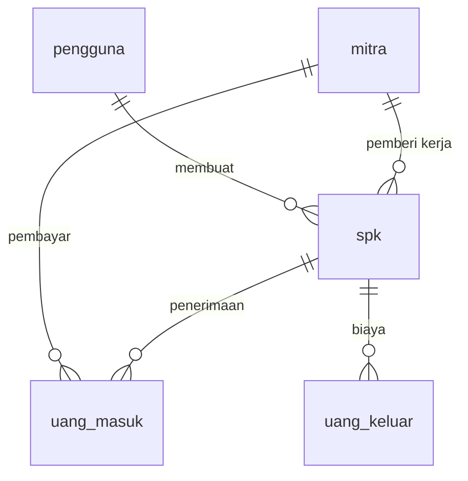

# Schema — Struktur Database (MySQL / MariaDB)
## Sistem Informasi SPK & Kontrol Keuangan — PT Barelang Kontraktor Sarana

> **Versi:** 3.0 — **5 TABEL** (sesuai `db.txt`)
> **Tanggal:** 19 September 2026
> **Menggantikan:** v2.2 (10 tabel) — tersimpan di `docs-backup-29agu/Schema-v2.2-10tabel.md`
> **Sumber:** `db.txt` + revisi user + SRS (untuk field tambahan)
> **Keputusan user:** **Ikuti `db.txt` — 5 tabel**, MySQL + **full Laravel**
>
> 📌 **Nama tabel & kolom memakai bahasa Indonesia**, sesuai `Rules.md`:
> *"Nama tabel database menggunakan `snake_case` berbahasa Indonesia sesuai Schema.md
> (jangan diterjemahkan ke bahasa Inggris agar konsisten dengan dokumen)."*

---

## 1. Keputusan yang Mengunci Schema Ini

| # | Keputusan | Dampak |
|---|---|---|
| 1 | **SPK adalah entitas inti. Tidak ada entitas PROYEK.** | Tidak ada tabel `proyek` |
| 2 | **Tidak ada Pengajuan Dana & Approval.** | Tidak ada tabel pengajuan; tidak ada field approval |
| 3 | **`spk_id` dipertahankan di `uang_keluar`** (boleh NULL) | Laba-rugi per SPK dapat dihitung |
| 4 | **Tidak ada approval Direktur.** | Field `disetujui_oleh` & `tanggal_persetujuan` **dihapus** |
| 5 | **SPK subkon/vendor masuk tabel `spk`** | Tidak ada tabel `subcon_spk` |
| 6 | **Tidak ada tabel `bukti` terpisah.** Bukti jadi kolom di tabel yang memerlukan | Tabel `bukti` **dihapus** |
| 7 | **Ikuti `db.txt` — 5 tabel, bukan 10** | Status & kategori jadi kolom, **bukan** tabel master |
| 8 | **MySQL + full Laravel** | Migration, Eloquent, validasi di aplikasi |

## 2. Ringkasan Tabel (5 Tabel)

| No | Tabel | Fungsi |
|---|---|---|
| 1 | `pengguna` | Akun pengguna sistem (Admin, Direktur) |
| 2 | `mitra` | Pihak terkait: PLN, pelanggan, vendor, subkon |
| 3 | `spk` | ⭐ Entitas inti — data SPK |
| 4 | `uang_masuk` | Uang masuk (dari SPK / luar SPK) |
| 5 | `uang_keluar` | Uang keluar (terkait SPK / umum) |

### Perbandingan dengan Versi 10 Tabel

| Versi 10 tabel | Versi 5 tabel (sekarang) |
|---|---|
| `roles` | ❌ dihapus → kolom `pengguna.peran` |
| `users` | ✅ → `pengguna` |
| `partners` | ✅ → `mitra` |
| `spk_statuses` | ❌ dihapus → kolom `spk.status_spk` |
| `billing_statuses` | ❌ dihapus → kolom `spk.status_tagihan` |
| `expense_categories` | ❌ dihapus → kolom `uang_keluar.kategori` |
| `spks` | ✅ → `spk` |
| `cash_ins` | ✅ → `uang_masuk` |
| `cash_outs` | ✅ → `uang_keluar` |
| `audit_logs` | ⚠️ lihat §7 — perlu keputusan |

## 3. Konvensi Umum

- Primary key: `BIGINT UNSIGNED` auto increment (konvensi Laravel).
- Foreign key: tipe **sama persis** dengan primary key yang dirujuk.
- Semua tabel operasional memiliki `created_at` dan `updated_at`.
- **Soft delete** (`deleted_at`) pada `spk`, `uang_masuk`, `uang_keluar`.
- **Nominal uang: `DECIMAL(18,2)`** — **DILARANG** `FLOAT`/`DOUBLE`.
- Unique constraint pada `spk.nomor_spk` dan `pengguna.email`.
- Index pada kolom yang sering difilter (status, tanggal, foreign key).
- **Nama tabel & kolom: bahasa Indonesia** (sesuai `Rules.md` §4).

## 4. DDL Lengkap

```sql
-- =========================================================
-- 1. pengguna
-- =========================================================
CREATE TABLE pengguna (
    id             BIGINT UNSIGNED PRIMARY KEY AUTO_INCREMENT,
    nama           VARCHAR(150) NOT NULL,
    email          VARCHAR(150) NOT NULL UNIQUE,
    password       VARCHAR(255) NOT NULL,
    peran          VARCHAR(50)  NOT NULL,        -- admin | direktur
    is_aktif       BOOLEAN DEFAULT TRUE,
    remember_token VARCHAR(100) NULL,
    created_at     TIMESTAMP NULL,
    updated_at     TIMESTAMP NULL
);
CREATE INDEX idx_pengguna_peran ON pengguna(peran);

-- =========================================================
-- 2. mitra
-- =========================================================
CREATE TABLE mitra (
    id         BIGINT UNSIGNED PRIMARY KEY AUTO_INCREMENT,
    nama       VARCHAR(200) NOT NULL,
    kategori   VARCHAR(50)  NOT NULL,   -- pln | pelanggan | vendor | subkon
    kontak     VARCHAR(100) NULL,
    alamat     VARCHAR(255) NULL,
    is_aktif   BOOLEAN DEFAULT TRUE,
    created_at TIMESTAMP NULL,
    updated_at TIMESTAMP NULL
);
CREATE INDEX idx_mitra_kategori ON mitra(kategori);

-- =========================================================
-- 3. spk  — ENTITAS INTI
-- =========================================================
CREATE TABLE spk (
    id             BIGINT UNSIGNED PRIMARY KEY AUTO_INCREMENT,
    nomor_spk      VARCHAR(150) NOT NULL UNIQUE,
    tanggal_spk    DATE NULL,                 -- NULL jika "TANPA SPK"
    tanggal_akhir  DATE NULL,                 -- 🆕 revisi db.txt: tanggal akhir SPK
    nama_pekerjaan VARCHAR(255) NOT NULL,
    lokasi         VARCHAR(255) NULL,
    nilai_spk      DECIMAL(18,2) NOT NULL,

    -- Retensi (untuk SPK subkon/vendor)
    persen_retensi DECIMAL(5,2)  NULL,        -- default 5.00
    nilai_retensi  DECIMAL(18,2) NULL,        -- = nilai_spk * persen_retensi / 100

    jenis_sumber   VARCHAR(50) NULL,          -- pln | luar | internal | lainnya
    sheet_lama     VARCHAR(100) NULL,         -- referensi sheet Excel lama
    mitra_id       BIGINT UNSIGNED NULL,      -- pemberi kerja
    status_spk     VARCHAR(50) NULL,          -- draft|terbit|berjalan|selesai|sudah_ditagihkan|dibatalkan
    status_tagihan VARCHAR(50) NULL,          -- belum_ditagihkan|sudah_ditagihkan|revisi_dokumen|menunggu_pembayaran|dibayar
    keterangan     TEXT NULL,                 -- ⚠️ lihat §7 catatan 1
    dibuat_oleh    BIGINT UNSIGNED NOT NULL,
    created_at     TIMESTAMP NULL,
    updated_at     TIMESTAMP NULL,
    deleted_at     TIMESTAMP NULL,

    CONSTRAINT fk_spk_mitra   FOREIGN KEY (mitra_id)   REFERENCES mitra(id),
    CONSTRAINT fk_spk_pembuat FOREIGN KEY (dibuat_oleh) REFERENCES pengguna(id),
    CONSTRAINT chk_spk_nilai  CHECK (nilai_spk >= 0)
);
CREATE INDEX idx_spk_nomor      ON spk(nomor_spk);
CREATE INDEX idx_spk_status     ON spk(status_spk);
CREATE INDEX idx_spk_tagihan    ON spk(status_tagihan);
CREATE INDEX idx_spk_tanggal    ON spk(tanggal_spk);
CREATE INDEX idx_spk_pekerjaan  ON spk(nama_pekerjaan);
CREATE INDEX idx_spk_mitra      ON spk(mitra_id);

-- =========================================================
-- 4. uang_masuk
-- =========================================================
CREATE TABLE uang_masuk (
    id             BIGINT UNSIGNED PRIMARY KEY AUTO_INCREMENT,
    spk_id         BIGINT UNSIGNED NULL,      -- NULL = uang masuk dari LUAR SPK
    nomor_spk      VARCHAR(150) NULL,         -- 🆕 revisi db.txt
    nama_pekerjaan VARCHAR(255) NULL,         -- 🆕 revisi db.txt
    tanggal        DATE NOT NULL,
    jumlah         DECIMAL(18,2) NOT NULL,
    mitra_id       BIGINT UNSIGNED NULL,
    keterangan     TEXT NULL,
    bukti          JSON NULL,                 -- 🆕 array path file (TF, gambar, PDF)
    created_at     TIMESTAMP NULL,
    updated_at     TIMESTAMP NULL,
    deleted_at     TIMESTAMP NULL,

    CONSTRAINT fk_masuk_spk   FOREIGN KEY (spk_id)   REFERENCES spk(id),
    CONSTRAINT fk_masuk_mitra FOREIGN KEY (mitra_id) REFERENCES mitra(id),
    CONSTRAINT chk_masuk_jumlah CHECK (jumlah > 0)
);
CREATE INDEX idx_masuk_spk     ON uang_masuk(spk_id);
CREATE INDEX idx_masuk_tanggal ON uang_masuk(tanggal);

-- =========================================================
-- 5. uang_keluar
-- =========================================================
CREATE TABLE uang_keluar (
    id         BIGINT UNSIGNED PRIMARY KEY AUTO_INCREMENT,
    spk_id     BIGINT UNSIGNED NULL,          -- ✅ dipertahankan (keputusan #3)
    tanggal    DATE NOT NULL,
    jumlah     DECIMAL(18,2) NOT NULL,
    kategori   VARCHAR(100) NULL,             -- material|upah|operasional|gaji|nota|transportasi|lainnya
    penerima   VARCHAR(200) NULL,             -- nama vendor/subkon/staf
    keterangan TEXT NULL,
    bukti      JSON NULL,                     -- 🆕 array path file (TF, gambar, PDF)
    created_at TIMESTAMP NULL,
    updated_at TIMESTAMP NULL,
    deleted_at TIMESTAMP NULL,

    CONSTRAINT fk_keluar_spk FOREIGN KEY (spk_id) REFERENCES spk(id),
    CONSTRAINT chk_keluar_jumlah CHECK (jumlah > 0)
);
CREATE INDEX idx_keluar_spk      ON uang_keluar(spk_id);
CREATE INDEX idx_keluar_tanggal  ON uang_keluar(tanggal);
CREATE INDEX idx_keluar_kategori ON uang_keluar(kategori);
```

## 5. Field yang Dihapus dari `db.txt` (sesuai revisi user)

### `spk`

| Field di `db.txt` | Status | Alasan |
|---|---|---|
| `pic` | ❌ **dihapus** | Revisi user: tidak digunakan |
| `keterangan` | ⚠️ **dipertahankan sementara** | Lihat §7 catatan 1 |
| — | ✅ **ditambah** `tanggal_akhir` | Revisi user |

### `uang_masuk`

| Field di `db.txt` | Status | Alasan |
|---|---|---|
| `nomor_transaksi` | ❌ dihapus | Revisi user |
| `sumber` | ❌ dihapus | Disimpulkan dari `spk_id` (ada = SPK, kosong = luar) |
| `metode_pembayaran` | ❌ dihapus | Revisi user |
| `status` | ❌ dihapus | Revisi user |
| `dicatat_oleh` | ❌ dihapus | Revisi user |
| — | ✅ **ditambah** `nama_pekerjaan`, `nomor_spk`, `bukti` | Revisi user |

**Form 2 mode (sesuai revisi user):**

| Mode | Field |
|---|---|
| **1. Berdasarkan SPK** | Dropdown list SPK + tanggal |
| **2. Manual** | Input `nama_pekerjaan` + `nomor_spk` bebas |

### `uang_keluar`

| Field di `db.txt` | Status | Alasan |
|---|---|---|
| `nomor_transaksi` | ❌ dihapus | Revisi user |
| `mitra_id` | ❌ dihapus | Diganti `penerima` (teks) |
| `metode_pembayaran` | ❌ dihapus | Revisi user |
| `status` | ❌ dihapus | Revisi user |
| `dicatat_oleh` | ❌ dihapus | Revisi user |
| `disetujui_oleh` | ❌ **dihapus** | Keputusan #4 — tidak ada approval |
| `tanggal_persetujuan` | ❌ **dihapus** | Keputusan #4 — tidak ada approval |
| `spk_id` | ✅ **dipertahankan** | Keputusan #3 — wajib untuk laba-rugi per SPK |
| — | ✅ **ditambah** `bukti` (TF, gambar, PDF) | Revisi user |

### Tabel `bukti` — DIHAPUS

| Asal | Status |
|---|---|
| Tabel `bukti` (polymorphic) | ❌ **dihapus** — bukti jadi kolom `bukti` di `uang_masuk` & `uang_keluar` |

> Karena bukti hanya dipakai 2 tabel, tabel terpisah tidak memberi manfaat.
> Kolom `bukti` bertipe **JSON** agar bisa menampung beberapa file sekaligus
> (mis. bukti transfer + nota) tanpa tabel tambahan.

## 6. Kolom Turunan (Dihitung, Tidak Disimpan)

Semua dihitung *on-the-fly* agar tidak ada data tidak sinkron.

| Nilai | Rumus |
|---|---|
| **Total Uang Masuk** | `SUM(uang_masuk.jumlah)` |
| **Uang Masuk dari SPK** | `SUM(jumlah) WHERE spk_id IS NOT NULL` |
| **Uang Masuk dari Luar** | `SUM(jumlah) WHERE spk_id IS NULL` |
| **Total Uang Keluar** | `SUM(uang_keluar.jumlah)` |
| **Pengeluaran per Kategori** | `SUM(jumlah) GROUP BY kategori` |
| **Saldo Bersih** | Total Uang Masuk − Total Uang Keluar |
| **Total Nilai SPK** | `SUM(spk.nilai_spk)` |
| **Jumlah SPK per Status** | `COUNT(*) GROUP BY status_spk` |
| **Retensi SPK** | `nilai_spk × persen_retensi / 100` |
| **Nilai Bersih SPK** | `nilai_spk − nilai_retensi` |
| **Penerimaan per SPK** | `SUM(uang_masuk.jumlah) WHERE spk_id = X` |
| **Biaya per SPK** | `SUM(uang_keluar.jumlah) WHERE spk_id = X` |
| **Piutang per SPK** | `nilai_spk − penerimaan SPK tersebut` |
| **Estimasi Laba/Rugi per SPK** | Penerimaan per SPK − Biaya per SPK |

## 7. ⚠️ Yang Perlu Keputusan

### 1. Kolom `keterangan` pada `spk`

- **Revisi `db.txt`:** `pic` dan `keterangan` **tidak digunakan**.
- **SRS:** *"Setiap transaksi perlu kolom keterangan... wajib tersedia pada SPK, uang masuk,
  uang keluar"*.
- **Data Excel:** **setiap baris** punya catatan: `27/7/2026 sudah diantar ke imperium`,
  `ada denda`, `PAKAI PT BKS`, `di potong 120.000 (uang material)`.

**Saya pertahankan `keterangan`** karena menghapusnya berarti kehilangan catatan follow-up
yang ada di setiap baris Excel. **Hapus atau pertahankan?**

### 2. Audit Log (dihapus di versi 5 tabel)

SRS **NFR-SEC-004** mewajibkan: *"Setiap perubahan nominal, status approval, dan upload
dokumen harus tercatat dalam audit log"*.

Di versi 5 tabel, `audit_logs` **tidak ada** (tidak ada di `db.txt`).

**Opsi:**
- **(a)** Tambahkan tabel `log_aktivitas` → jadi **6 tabel**
- **(b)** Pakai package pihak ketiga (`spatie/laravel-activitylog`) → tetap **5 tabel**
  karena tabelnya dibuat otomatis oleh package
- **(c)** Tidak ada audit log → **menyimpang dari SRS**

**Rekomendasi saya: opsi (b)** — tetap 5 tabel sesuai keinginan user, tapi tetap memenuhi SRS.
**Perlu keputusan Anda.**

### 3. Dokumen SPK (BAST, kuitansi, scan SPK)

Karena tabel `bukti` dihapus dan bukti hanya di `uang_masuk` & `uang_keluar`, dokumen SPK
**tidak punya tempat**. Padahal SRS mencantumkan upload dokumen pada form SPK.

**Opsi:**
- **(a)** Tambahkan kolom `dokumen` (JSON) pada `spk` — konsisten dengan pola `bukti`
- **(b)** Dokumen SPK disimpan di luar sistem (folder manual)

**Rekomendasi: opsi (a).**

### 4. Jumlah file bukti per transaksi

Kolom `bukti` dirancang **JSON array** agar bisa menampung beberapa file.
Jika hanya butuh **satu file**, bisa diubah jadi `VARCHAR(255)`. **Perlu konfirmasi.**

## 8. ⚠️ Risiko Desain 5 Tabel & Cara Mitigasinya

Risiko ini **sudah saya buktikan** dengan uji di MariaDB 11.8 (dua skema, data identik).

### Bukti Risiko: Laporan Terpecah

Data yang sama dimasukkan ke dua skema:

| Tanggal | Kategori yang diketik | Jumlah |
|---|---|---|
| 01/07 | Material | 40.000.000 |
| 03/07 | Material Bangunan | 15.000.000 |
| 05/07 | Material2 *(typo)* | 5.000.000 |
| 12/07 | Upah | 25.000.000 |
| 14/07 | Upah Tukang | 10.000.000 |
| 20/07 | Operasional | 3.000.000 |

**Hasil pada skema kolom teks (5 tabel):**

| Kategori | Jml | Total |
|---|---|---|
| Material | 1 | 40.000.000 |
| Upah | 1 | 25.000.000 |
| Material Bangunan | 1 | 15.000.000 |
| Upah Tukang | 1 | 10.000.000 |
| Material2 | 1 | 5.000.000 |
| Operasional | 1 | 3.000.000 |

→ **6 baris.** Data "Material" terpecah 3, "Upah" terpecah 2. **Laporan salah.**

**Hasil pada skema master + FK (10 tabel):** 3 baris, Material = 60 jt, Upah = 35 jt. **Benar.**

### Daftar Risiko & Mitigasi

| # | Risiko | Berat | Mitigasi dengan **full Laravel** |
|---|---|---|---|
| 1 | Laporan terpecah karena kategori ditulis berbeda | 🔴 Tinggi | **PHP Enum** + dropdown. Admin memilih, tidak mengetik |
| 2 | Typo status SPK → filter & laporan salah | 🔴 Tinggi | **PHP Enum** + validasi `Rule::enum()` |
| 3 | Tambah status baru perlu `ALTER TABLE` | 🟡 Sedang | Bisa dihindari dengan Enum; atau terima migration saat butuh |
| 4 | Tidak ada proteksi di level database | 🟡 Sedang | **Form Request** + validasi enum di aplikasi |
| 5 | Audit log tidak ada | 🟡 Sedang | `spatie/laravel-activitylog` (tetap 5 tabel) |
| 6 | Storage sedikit lebih besar | 🟢 Rendah | Tidak perlu ditangani |

### Solusi Utama: PHP Enum (bawaan Laravel)

```php
<?php
declare(strict_types=1);

namespace App\Enums;

enum StatusSpk: string
{
    case Draft           = 'draft';
    case Terbit          = 'terbit';
    case Berjalan        = 'berjalan';
    case Selesai         = 'selesai';
    case SudahDitagihkan = 'sudah_ditagihkan';
    case Dibatalkan      = 'dibatalkan';

    public function label(): string
    {
        return match ($this) {
            self::Draft           => 'Draft',
            self::Terbit          => 'Terbit',
            self::Berjalan        => 'Berjalan',
            self::Selesai         => 'Selesai',
            self::SudahDitagihkan => 'Sudah Ditagihkan',
            self::Dibatalkan      => 'Dibatalkan',
        };
    }
}
```

**Di model Eloquent:**

```php
protected function casts(): array
{
    return ['status_spk' => StatusSpk::class];
}
```

**Di Form Request (validasi):**

```php
'status_spk' => ['required', Rule::enum(StatusSpk::class)],
'kategori'   => ['required', Rule::enum(KategoriPengeluaran::class)],
```

**Di form Blade (dropdown dari enum, bukan input bebas):**

```blade
<select name="status_spk">
    @foreach (App\Enums\StatusSpk::cases() as $s)
        <option value="{{ $s->value }}">{{ $s->label() }}</option>
    @endforeach
</select>
```

**Hasil:** Admin **tidak bisa** mengetik bebas → typo mustahil → laporan tetap konsisten,
**tanpa tabel master**. Ini menutup risiko #1, #2, dan #4 hampir sepenuhnya.

> 📌 **Catatan:** penamaan case Enum di PHP mengikuti konvensi `PascalCase` (aturan framework),
> sedangkan nilai database tetap `snake_case` (aturan `Rules.md` §4). Keduanya tidak bertabrakan.

## 9. Rencana Pivot ke 10 Tabel (Nanti)

Karena Anda menyebut *"nanti kedepannya baru pivot ke lain"*, berikut jalur pivotnya —
**tanpa membuang data**:

| Langkah | Aksi |
|---|---|
| 1 | Buat tabel master: `status_spk`, `status_tagihan`, `kategori_pengeluaran` |
| 2 | Isi dari nilai distinct yang sudah ada: `INSERT INTO status_spk SELECT DISTINCT status_spk FROM spk` |
| 3 | Tambah kolom FK: `ALTER TABLE spk ADD COLUMN status_spk_id BIGINT UNSIGNED NULL` |
| 4 | Isi FK: `UPDATE spk s JOIN status_spk m ON m.nama = s.status_spk SET s.status_spk_id = m.id` |
| 5 | Hapus kolom lama: `ALTER TABLE spk DROP COLUMN status_spk` |
| 6 | Tambah foreign key constraint |
| 7 | Ubah Enum → relasi Eloquent (`belongsTo`) |

**Yang memudahkan pivot:** karena Enum dipakai sejak awal, nilai di database **sudah konsisten**
(`draft`, `terbit`, `berjalan`, ...) — jadi langkah 2 & 4 bersih tanpa duplikasi/typo.

> ⚠️ Kalau sejak awal pakai teks bebas tanpa Enum, pivot-nya akan berantakan karena data
> kategori sudah terpecah dan harus dibersihkan manual.

## 10. Relasi (ERD Tekstual)

```
pengguna
  ├── hasMany spk          (dibuat_oleh)

mitra
  ├── hasMany spk          (mitra_id — pemberi kerja)
  └── hasMany uang_masuk   (mitra_id — pembayar)

spk
  ├── belongsTo pengguna   (dibuat_oleh)
  ├── belongsTo mitra      (mitra_id)
  ├── hasMany uang_masuk   (spk_id, nullable)
  └── hasMany uang_keluar  (spk_id, nullable)

uang_masuk
  ├── belongsTo spk        (nullable)
  └── belongsTo mitra      (nullable)

uang_keluar
  └── belongsTo spk        (nullable)
```



## 11. Aturan Integritas

1. `jumlah` **harus > 0**; `nilai_spk` **harus ≥ 0**.
2. Arah transaksi ditentukan oleh **tabel** (`uang_masuk`/`uang_keluar`), bukan tanda minus.
3. **Sumber uang masuk disimpulkan dari `spk_id`:**
   - `spk_id` **terisi** → uang masuk dari SPK
   - `spk_id` **NULL** → uang masuk dari luar SPK
4. Uang keluar terkait SPK → `spk_id` diisi; pengeluaran umum → `spk_id` boleh `NULL`.
5. **`status_spk`, `status_tagihan`, `kategori`, `jenis_sumber`, `peran`, `mitra.kategori`
   WAJIB divalidasi memakai PHP Enum** — tidak boleh teks bebas (mitigasi risiko §8).
6. Histori keuangan **tidak boleh dihapus fisik** — gunakan soft delete.
7. `nomor_spk` **unique** — tetapi data Excel saat ini punya **nomor SPK duplikat** dan
   **14 record tanpa nomor SPK**. Wajib *cleansing* sebelum import.
8. Operasi yang mengubah beberapa tabel wajib memakai `DB::transaction`.

## 12. Rencana Migrasi Data dari Excel

| Sumber Data Lama | Target | Aturan |
|---|---|---|
| Daftar SPK dari banyak sheet | `spk` | Semua SPK disatukan; sheet lama → `sheet_lama` |
| Uang masuk dari SPK | `uang_masuk` | `spk_id` **wajib** diisi |
| Uang masuk dari luar SPK | `uang_masuk` | `spk_id` kosong |
| Uang keluar terkait SPK | `uang_keluar` | `spk_id` diisi |
| Uang keluar umum | `uang_keluar` | `spk_id` kosong |
| Daftar user | `pengguna` | Hanya `admin` atau `direktur` |

### ⚠️ Kualitas Data Referensi SPK

| Masalah | Jumlah |
|---|---|
| Record **tanpa nomor SPK** | 14 |
| Record **tanpa tanggal** | 14 |
| Record **tanpa dokumen** | 91 (seluruhnya) |
| **Nomor SPK duplikat** | Ada |

**Urutan wajib sebelum import production:**
`cleansing` → `deduplikasi` → `rekonsiliasi nilai` → `validasi sampel` →
tetapkan `nomor_spk` sebagai unique key.

## 13. Output Laporan

| Laporan | Sumber Data | Tujuan |
|---|---|---|
| Laporan SPK | `spk` | Daftar SPK, nilai, status, tagihan |
| Laporan Uang Masuk | `uang_masuk` | Seluruh penerimaan dari SPK & luar SPK |
| Laporan Uang Keluar | `uang_keluar` | Seluruh pengeluaran per kategori & periode |
| Laporan Cashflow | `uang_masuk` + `uang_keluar` | Perbandingan masuk vs keluar per periode |
| Laporan SPK Belum Dibayar | `spk` + `uang_masuk` | Selisih nilai SPK vs pembayaran diterima |
| **Laporan Laba-Rugi per SPK** | `spk` + `uang_masuk` + `uang_keluar` | Penerimaan − biaya ⭐ |

---

## 14. Ringkasan Perubahan v3.0

| Aspek | v2.2 (10 tabel) | v3.0 (5 tabel) |
|---|---|---|
| Jumlah tabel | 10 | **5** |
| Nama tabel | Inggris (`users`, `spks`, `cash_ins`) | **Indonesia** (`pengguna`, `spk`, `uang_masuk`) |
| Nama kolom | Inggris | **Indonesia** |
| Status & kategori | Tabel master + FK | **Kolom + PHP Enum** |
| Audit log | Tabel `audit_logs` | Opsi: package `spatie/laravel-activitylog` |
| Risiko laporan terpecah | Tidak ada | Ada — **dimitisigasi dengan Enum + dropdown** |
| Sesuai `db.txt` | Tidak | **Ya** |
| Sesuai `Rules.md` §4 (nama Indonesia) | Tidak | **Ya** |

> Versi 10 tabel tersimpan di `docs-backup-29agu/Schema-v2.2-10tabel.md`
> sebagai referensi jika nanti ingin pivot.

---

*Schema v3.0 — 5 tabel, sesuai `db.txt` dan keputusan user 19 September 2026.
Dokumen v1.0 tersimpan di `docs-backup-29agu/Schema.md`.*
